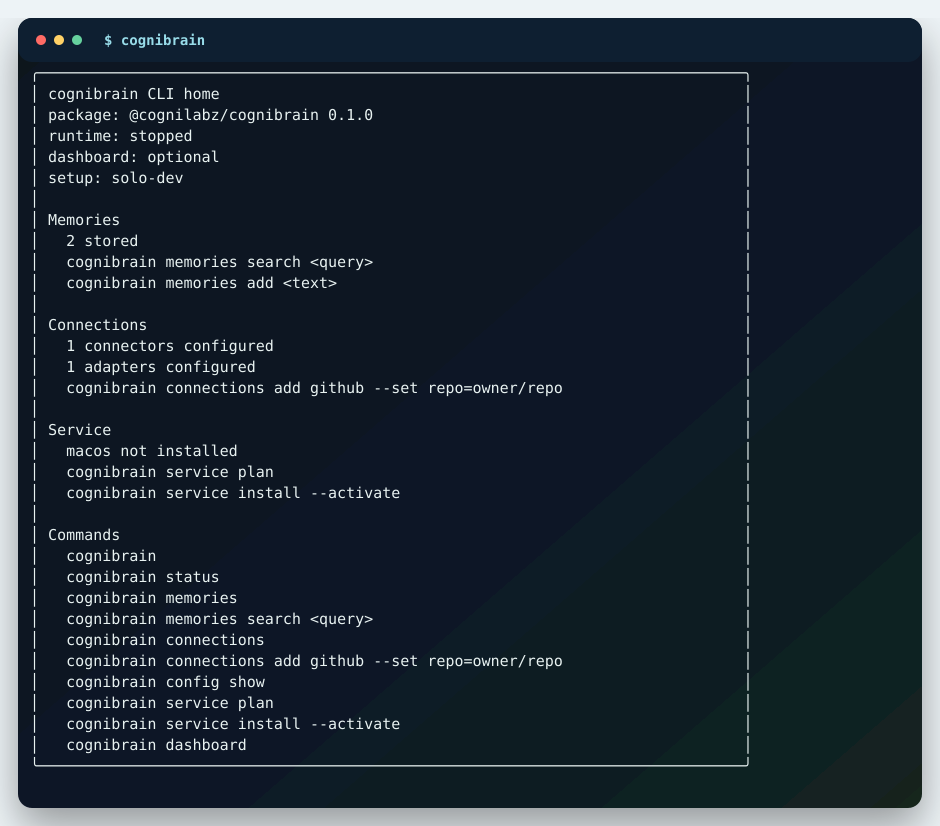
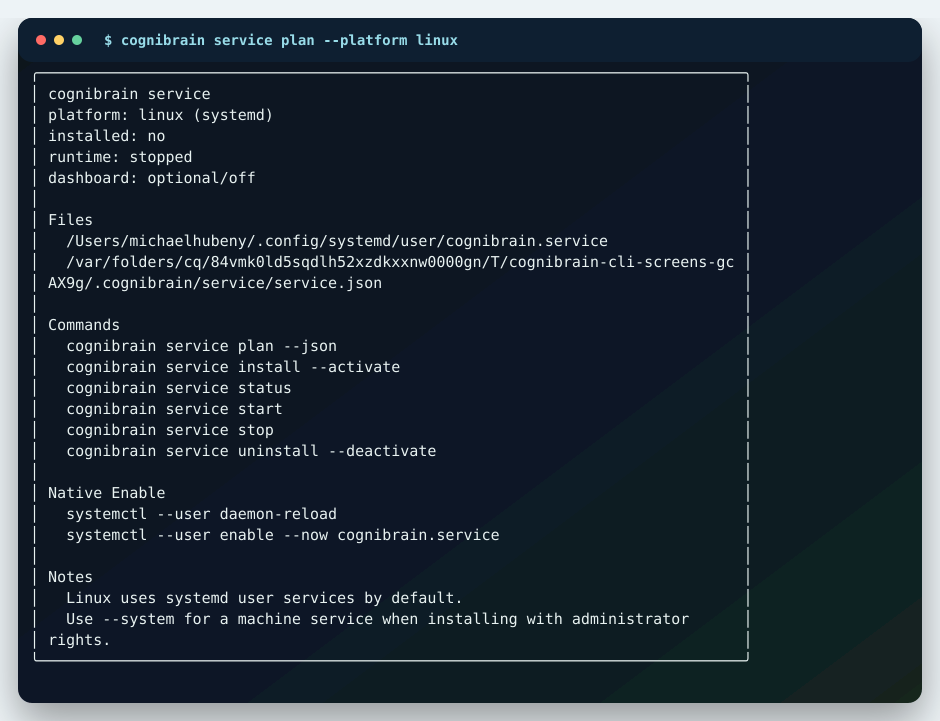
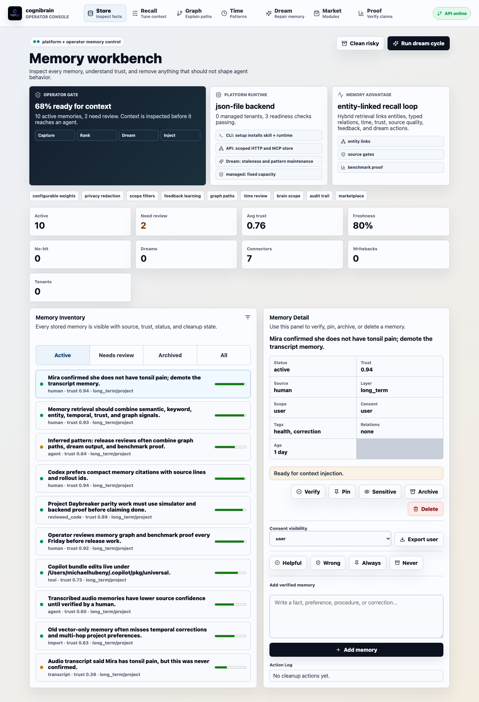
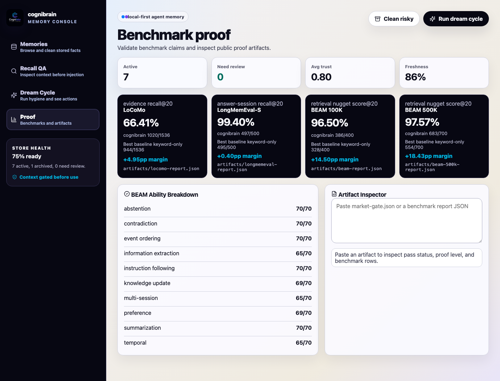

# Cognibrain

Self-hosted engineering memory for coding agents.

Cognibrain gives Codex, Claude Code, Cursor, Copilot, OpenCode, LangGraph and CrewAI a durable memory layer for corrections, decisions, tool outcomes, connector events and release evidence. The goal is practical: Stop fixing the same agent mistake twice.

<p align="center">
  
</p>

## Why It Exists

Modern coding agents are strong in a single session and forgetful across weeks, tools and repositories. Cognibrain stores the durable parts of engineering work, then returns compact, cited context before the next patch:

- repo rules and reviewer corrections,
- failed commands and the command that should be used next time,
- source-system events from issues, chat, docs, incidents and analytics,
- temporal facts, graph links and policy decisions,
- patch evidence that explains why a memory was used.

The primary product surface is the installable Ink CLI. The dashboard is optional.

```bash
npm i @cognilabz/cognibrain
npx cognibrain
```

Proof-first story:

1. A coding agent repeats a wrong action.
2. A reviewer correction becomes durable engineering memory.
3. The next patch receives cited context and an action guard.
4. The benchmark checks whether the same mistake was avoided.

Recall is not enough. The next code change has to prove the memory worked.

## What You Get

| Surface | What it does |
| --- | --- |
| Ink CLI | Home, memories, connections, service automation, config, connectors, adapters, SDK, skill and doctor workbenches. |
| Memory OS API | Local HTTP API, MCP server, typed TypeScript SDK and Python client. |
| Agent setup | Generates Codex, Claude Code, Cursor, Copilot, VS Code, OpenCode, OpenClaw, LangGraph and CrewAI integration files. |
| Native connectors | GitHub, GitLab, Azure DevOps, Slack, Discord, Teams, Jira, Confluence, Notion, Linear, Gmail, Google Drive, Google Calendar, Asana, ClickUp, Sentry, Datadog, PagerDuty and PostHog. |
| Platform SDK | Scaffold a real custom integration when your source system is not built in yet. |
| Self-hosted service | Linux systemd, macOS launchd and Windows Task Scheduler service plans from the CLI. |
| Benchmark proof | Local deterministic benchmark artifacts, public same-scenario reports and competitor comparison with explicit proof boundaries. |

Docker is optional for deployment packaging. The CLI is the required control plane for install, setup, service automation, connectors, adapters, SDK scaffolding and proof inspection.

## CLI Screenshots

<p align="center">
  
</p>

<p align="center">
  
</p>

Regenerate the screenshots from real CLI output:

```bash
npm run docs:cli-screenshots
```

## Install

```bash
npm i @cognilabz/cognibrain
npx cognibrain init
npx cognibrain doctor --fix
```

Package-free checkout path:

```bash
git clone https://github.com/cognilabz/cognibrain.git
cd cognibrain
npm install
./bin/cognibrain.mjs init --profile solo-dev --yes
./bin/cognibrain.mjs doctor --fix
```

Dashboard is opt-in:

```bash
npx cognibrain dashboard
# or
npx cognibrain start --dashboard
```

Service startup is CLI-controlled:

```bash
npx cognibrain service plan
npx cognibrain service plan --platform linux --json
npx cognibrain service plan --platform macos --json
npx cognibrain service plan --platform windows --json
npx cognibrain service install --activate
```

More setup detail: [docs/install.md](docs/install.md).

## Daily Usage

```bash
npx cognibrain status
npx cognibrain memories
npx cognibrain memories add "This repo uses npm test, not pnpm."
npx cognibrain memories coding-context "prepare the release patch"
npx cognibrain connections
npx cognibrain connections add github --set repo=cognilabz/cognibrain
npx cognibrain connections doctor
npx cognibrain proof
npx cognibrain sdk platform acme --kind project_management --out integrations/acme
```

The lower-level memory command remains available for scripts:

```bash
npx cognibrain memory add "Release patches must include npm test output."
npx cognibrain memory search "release command"
npx cognibrain memory why-used "Why did this release memory appear?"
npx cognibrain memory patch-evidence "release patch"
```

## Benchmark Evidence

Checked artifact: `artifacts/arena/run.json`, generated by:

```bash
npm run benchmark:arena
```

Current local Benchmark Arena result, 30 deterministic engineering-memory scenarios:

| System | Score | Proof level | Repeated mistake rate | Gaps |
| --- | ---: | --- | ---: | ---: |
| Cognibrain | 0.9722 | same-run-full | 0 | 0 |
| LangMem | 0.6667 | same-run-native | 1 | 6 |
| Mem0 | 0.6667 | same-run-native | 1 | 7 |
| GBrain | 0.1556 | same-run-cli | 1 | 5 |
| Graphiti/Zep | 0.0000 | credential-blocked | 1 | 4 |
| Cognee | 0.0000 | credential-blocked | 1 | 4 |

Boundary: competitor rows are only as strong as their proof level. Cognibrain's row runs the full local implementation. Mem0 and LangMem are now checked through real same-run-native package runners. GBrain is checked as a real same-run-cli competitor row through `gbrain capture/search/get`. Graphiti/Zep and Cognee are credential-blocked unless LLM/vendor credentials are supplied; no API-shape score is shown for them in the checked artifact. See [docs/benchmarks.md](docs/benchmarks.md).

Arena v2 supports native package runners, cloud/API runners, CLI runners and imported vendor artifacts. Rows stay `credential-blocked` or `same-run-api-shape` until code executes the stronger path. See [Same Benchmark](docs/market/same-benchmark.md) and the generated [Latest Arena](docs/benchmarks/latest-arena.md).

CogniCodeBench also runs 100 deterministic synthetic coding-agent scenarios:

```bash
npm run benchmark:cognicode
```

## Integrations

Native connector verification:

```bash
npm run verify:connectors
npm run verify:vendor-connectors
npm run verify:vendor-api-specs
npm run verify:vendor-live
npm run connectors:maturity
```

Current checked connector state: 19 hermetic drivers, 19 API/spec-verified drivers, 0 tenant live smokes and 0 production certifications. Live-system proof requires tenant credentials plus `MEMORY_VENDOR_LIVE_SMOKE=true npm run verify:vendor-live`; writeback to real systems stays dry-run unless explicitly enabled.

Connector configs store non-secret choices and `env:` references. Token values stay outside the repo:

```bash
npx cognibrain connections add jira --set baseUrl=https://example.atlassian.net --set project=ENG
npx cognibrain connections add slack --set channelId=C123 --token-env MEMORY_SLACK_TOKEN
npx cognibrain connections add storage-postgres --url-env MEMORY_POSTGRES_URL
```

Build your own source integration:

```bash
npx cognibrain sdk platform acme --kind project_management --out integrations/acme
npx cognibrain memory connector-register "$(cat integrations/acme/acme.connector.json)"
```

More detail: [docs/integrations.md](docs/integrations.md).

## Production Boundary

Cognibrain is packaged as a self-hosted production candidate. The release gate is:

```bash
npm run release:check
```

The current release check covers unit tests, dashboard build, status verification, CogniCodeBench, Benchmark Arena, first-win demo, docs audit, Postgres verification, connector compatibility including API/spec checks, local runtime start, publish doctor, npm pack dry-run and Python SDK tests.
`npm run audit:truth` is part of that gate and fails on code/doc overclaims while keeping open implementation gaps visible.

This repository does not claim managed SaaS uptime, billing, hosted support, autoscaling or deployment-specific SSO readiness. Those remain future or deployment-specific claims. See [docs/operations.md](docs/operations.md) and [docs/claims.md](docs/claims.md).

## Optional Dashboard

The CLI is the default product. The browser dashboard is a visual inspection layer over the same runtime.

<p align="center">
  
  
</p>

## Documentation

- [Documentation home](docs/README.md)
- [Install and self-hosting](docs/install.md)
- [Benchmarks and competitor proof](docs/benchmarks.md)
- [Connectors, adapters and SDK](docs/integrations.md)
- [Operations and production boundary](docs/operations.md)
- [CLI, API and SDK reference](docs/reference.md)
- [Claims and evidence map](docs/claims.md)

## Repository Map

```text
bin/                 installable CLI entrypoints
src/api/             local HTTP API and service layer
src/cli/             memory command surface
src/connectors/      native vendor drivers, MCP server and Platform SDK helpers
src/core/            memory types, retrieval, policy, graph and lifecycle logic
src/dashboard/       optional React dashboard
src/eval/            benchmark and verification suites
scripts/             release, docs and demo automation
docs/                compact product documentation and screenshots
sdk/python/          dependency-free Python client
```

## License

MIT. See [LICENSE](LICENSE).
