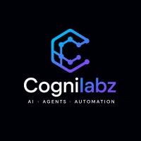
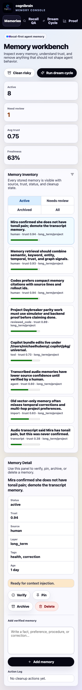
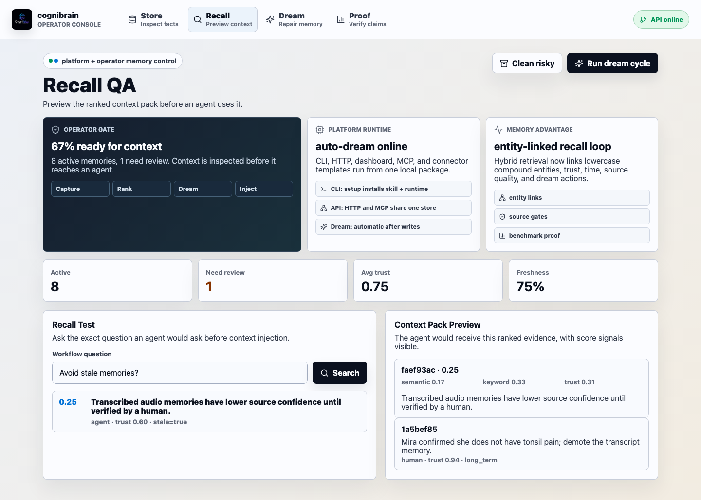
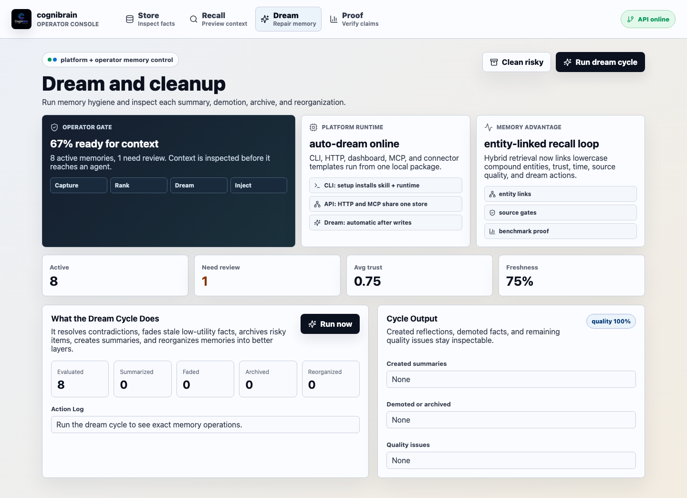

<p align="center">
  
</p>

<h1 align="center">cognibrain</h1>

<p align="center">
  <strong>Inspectable memory infrastructure for AI agents.</strong>
</p>

<p align="center">
  <a href="#quick-start">Quick Start</a> ·
  <a href="#proof">Proof</a> ·
  <a href="#architecture">Architecture</a> ·
  <a href="#documentation">Documentation</a>
</p>

cognibrain is a local-first TypeScript memory platform for AI agents that need durable context without opaque recall. It stores memories with source quality, trust, citations, lifecycle state, retrieval evidence, graph paths, brain/source scope, audit events, and pluggable persistence so teams can see why an agent remembers something before that memory influences real work.

The project includes the memory engine, HTTP API, CLI, official connector manifests, provider adapters, MCP connector, harness hook, operator dashboard, benchmark suite, and a self-maintenance loop called `dream`.




## Interface Tour

| Memory workbench | Recall QA |
| --- | --- |
|  |  |

| Dream cycle | Benchmark proof |
| --- | --- |
|  |  |

## Why cognibrain

Agent memory often fails in one of two ways: it is either a simple vector search that misses time, trust, and contradictions, or a vague long-term summary that cannot be audited. cognibrain is built for operational memory: compact enough to use, structured enough to inspect, and measurable enough to improve.

It is designed for teams that care about:

- source-aware recall instead of unqualified chat-history reuse,
- a platform/operator split: install and run the platform once, then inspect what the operator lets into context,
- zero-dependency entity linking from proper nouns, paths, quoted phrases, and compound terms,
- ranked evidence with citations and trust signals,
- graph-native path explanation and rule-based inferred relations,
- brain/source/agent/persona primitives for multi-agent team memory,
- official connector manifests for email, chat, project management, docs, code, calendars, and cloud storage,
- provider adapters for extraction, translation, query expansion, reranking, verification, contradiction, and summaries with deterministic fallbacks,
- pluggable storage with atomic JSON snapshots, append-only JSONL logs, storage introspection, and offline sync replay,
- audit, webhook delivery/retry, marketplace, and compliance surfaces,
- lifecycle maintenance for stale or contradictory facts,
- clear integration surfaces for coding agents and AI workflows,
- reproducible benchmark gates instead of unsupported memory claims.

## Dashboard

The dashboard is a working inspection surface, not a decorative demo. It presents cognibrain as a platform runtime plus an operator gate:

| Section | Why it exists |
| --- | --- |
| Operator gate | Shows whether context is ready before an agent can use it. |
| Platform runtime | Shows that CLI, HTTP, dashboard, MCP, and templates run from one local package. |
| Memory advantage | Explains the current USP: entity-linked hybrid recall plus dream maintenance. |
| Health metrics | Shows whether the memory store is fresh, trusted, and active. |
| Recall QA | Lets a user test the exact context an agent would receive. |
| Dream cycle | Proves memory hygiene by summarizing, fading, reflecting, and reorganizing facts. |
| Ranked evidence | Exposes score, citation, and trust for each retrieved memory. |
| Benchmark evidence | Keeps local and public market proof visible. |
| Artifact inspector | Lets benchmark JSON be checked without leaving the UI. |

## Quick Start

Requirements:

- Node.js 20 or newer
- npm

One command from this checkout:

```bash
./bootstrap.sh --all
```

Or use the CLI directly:

```bash
npm install
./bin/cognibrain.mjs setup --all-harnesses
```

After publishing the package, the same one-click path is:

```bash
npx cognibrain setup --all-harnesses
```

`setup` installs the Codex Skill, optionally writes MCP configs for Codex, Claude, Cursor, and VS Code, starts the API plus dashboard, and runs `doctor`.

Then open the printed dashboard URL. Runtime and publish helpers:

```bash
./bin/cognibrain.mjs status
./bin/cognibrain.mjs doctor --publish
./bin/cognibrain.mjs stop
./bin/cognibrain.mjs skill install
./bin/cognibrain.mjs clean
```

## Usage

Add a memory:

```bash
./bin/cognibrain.mjs memory add "Project Atlas uses TypeScript for all harness components."
```

Search memory:

```bash
./bin/cognibrain.mjs memory search "What language does Atlas use?"
```

Extract add-only memories from an event or conversation:

```bash
./bin/cognibrain.mjs memory extract "Atlas now uses Redis for cache. Verified npm test passed."
```

Give retrieval feedback:

```bash
./bin/cognibrain.mjs memory feedback <memory-id> helpful
./bin/cognibrain.mjs memory metrics
```

Run the maintenance cycle:

```bash
./bin/cognibrain.mjs memory dream
```

Inspect connectors and ingest a connector event:

```bash
./bin/cognibrain.mjs memory connectors
./bin/cognibrain.mjs memory connector-sync official-chat "Support confirmed the release note owner."
```

Translate or ingest a media transcript with language metadata:

```bash
MEMORY_LANGUAGE=de ./bin/cognibrain.mjs memory translate "Speicher soll nicht fehler"
MEMORY_MEDIA_TYPE=audio MEMORY_LANGUAGE=de ./bin/cognibrain.mjs memory media-ingest "Speicher soll release notes erfassen."
```

Check health:

```bash
./bin/cognibrain.mjs memory health
```

Check automatic maintenance:

```bash
./bin/cognibrain.mjs memory maintenance
```

## API

Create a memory:

```bash
curl -X POST http://localhost:8787/memories \
  -H "content-type: application/json" \
  -d '{
    "userId": "dev",
    "content": "Project Atlas uses TypeScript for all harness components.",
    "source": {"kind": "human", "confidence": 0.96},
    "tags": ["project", "typescript"]
  }'
```

Search:

```bash
curl -X POST http://localhost:8787/search \
  -H "content-type: application/json" \
  -d '{"userId": "dev", "appId": "codex", "query": "What language should Atlas use?", "limit": 5}'
```

Dream:

```bash
curl -X POST http://localhost:8787/dream \
  -H "content-type: application/json" \
  -d '{"userId": "dev"}'
```

Inspect connector/provider status and sync connector events:

```bash
curl http://localhost:8787/connectors
curl http://localhost:8787/providers
curl -X POST http://localhost:8787/connectors/sync \
  -H "content-type: application/json" \
  -d '{"connectorId":"official-chat","userId":"dev","events":[{"role":"user","content":"Support confirmed the release note owner.","externalId":"msg-1"}]}'
```

## Memory Lifecycle

The `dream` cycle is the self-maintenance loop for the memory store:

- Rethink repeated or contradictory memories.
- Reevaluate source confidence, usage, and remaining issues.
- Summarize repeated themes into auditable reflection memories.
- Fade stale low-utility memories.
- Reflect on contradictions and demote weaker claims.
- Reorganize procedures, transcripts, and stable facts into better layers.

Pinned memories are never faded or archived.

The current runtime also supports configurable and scoped learned retrieval profiles, `hybrid`/`rrf`/`graph`/`path` retrieval modes, deterministic or provider-backed query expansion, behavioural retrieval scoring, contradiction-aware context selection, graph path/activation/export reasoning, JSON-command intelligence adapters, deterministic fallback reranking, verifier/summarizer/classifier/extractor/translator providers, official connector manifests, connector sync records, webhook delivery/retry inspection, scoped memory (`sessionId`, `appId`, `orgId`, `projectId`), multi-tenant brains/sources with explicit shared-brain federation, agent subscriptions, shared-memory review/revoke workflows, persona defaults, consent mutation, audit history and revert, offline operation queues, explicit identity links, privacy consent flags, secret redaction/encryption, canonical entity records with merge/split suggestions, typed relations, staged add-only extraction with media/language envelopes, translated media ingestion, enrichment candidates, hour/day/week/month temporal timelines, persisted timeline summaries, multilingual contradiction checks, behavioral-pattern review, feedback-based trust/importance updates, domain evaluations, local metrics, lifecycle preview, and export/delete APIs.

## Connectors

cognibrain exposes four integration surfaces. The CLI is the primary install and runtime surface; MCP is available for compatible agent clients without making MCP the only way to operate the platform.

- HTTP API for apps and services,
- CLI for local scripts,
- TypeScript harness hook for direct agent runtimes,
- stdio MCP server for MCP-compatible tools.

Start MCP:

```bash
./bin/cognibrain.mjs mcp
MCP_PORT=8788 ./bin/cognibrain.mjs mcp --http
```

Available MCP tools:

- `memory_add`
- `memory_search`
- `memory_context_pack`
- `memory_list`
- `memory_reflect`
- `memory_dream`
- `memory_health`
- `memory_maintenance_status`

Connector templates are included for Claude Code, Codex, GitHub Copilot, and Cursor under `templates/`.

## Proof

Local verification:

```bash
npm run verify
```

Next-generation feature verification:

```bash
npm run verify:nextgen
```

Certified benchmark gate:

```bash
npm run benchmark:certified
```

Public market-claim gate:

```bash
npm run benchmark:market -- --competitors docs/public-market-claims.json --out artifacts/market-gate-public.json
```

Latest checked evidence:

| Dataset | cognibrain | Result |
| --- | ---: | --- |
| LoCoMo | `1095/1536`, `71.29%` | Beats best included baseline `63.87%` |
| LongMemEval-S | `497/500`, `99.40%` | Beats best included baseline `99.00%` |
| BEAM 100K | `386/400`, `96.50%` | Beats Graphonomous public `95.0%` |
| BEAM 500K | `683/700`, `97.57%` | Beats Graphonomous public `96.9%` |

The public market gate is a public-claim comparison, not a vendor-signed rerun. Stronger commercial proof should import vendor artifacts with the same dataset, metric, top-K, and budget.

## Architecture

```text
src/core/          Memory model, store, graph reasoning, retrieval, reflection, health
src/api/           Node HTTP API and service facade
src/cli/           memctl command line interface
src/connectors/    Harness hook, MCP handlers, MCP server
src/dashboard/     React dashboard
src/eval/          Benchmark runners, fixtures, baselines, market gate
tests/             Vitest tests for core behavior and evaluation proof
templates/         Connector starter templates
docs/              Setup, API, lifecycle, connector, and benchmark docs
docker/            Container and compose files
```

## Documentation

- [API Reference](docs/api-reference.md)
- [Configuration](docs/configuration.md)
- [Integration Guide](docs/integration-guide.md)
- [Memory Lifecycle](docs/lifecycle.md)
- [Connectors](docs/connectors.md)
- [Benchmarking](docs/benchmarking.md)
- [Market Comparison](docs/market-comparison.md)
- [Advanced Features](docs/advanced-features.md)
- [Roadmap](docs/roadmap.md)

## Open-Source Readiness

This repository is prepared as a public Cognilabz project:

- MIT license,
- reproducible install and verification commands,
- CI workflow,
- Docker starter files,
- contribution guide,
- security policy,
- dashboard screenshots,
- generated benchmark artifacts kept out of source control under `artifacts/`.

## Contributing

Start with:

```bash
npm install
npm run verify
```

Before opening a change, run:

```bash
npm run test
npm run build
```

For benchmark-related changes, run the relevant benchmark command and update documentation only from generated artifacts.

CI runs the synthetic evaluation artifact on every push and pull request. Weekly or manually triggered CI runs execute the certified benchmark gate and upload the generated proof artifacts.

## Safety

Do not store secrets, private keys, raw credentials, medical records, or sensitive transcripts unless your project has an explicit retention policy. Connectors should default to project-local scope and explicit user consent for durable storage.
