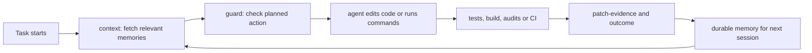
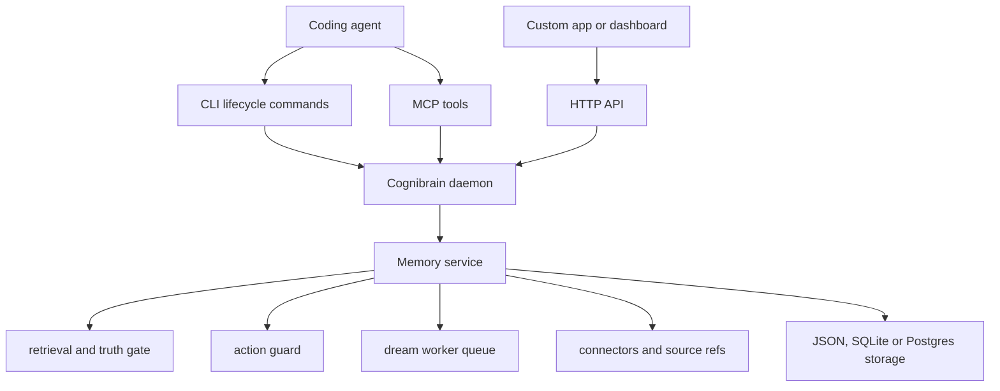
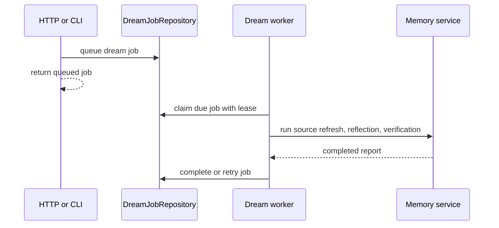

# Cognibrain

Self-hosted engineering memory for coding agents.

Your agent should not rediscover the same repo rules, failed commands, reviewer corrections and release constraints every session. Cognibrain stores durable engineering context, retrieves the compact parts that matter before the next action, warns before known bad actions, and records patch evidence after the work is done.

The practical promise is simple: Stop fixing the same agent mistake twice.

## The Short Version

Cognibrain is a self-hosted memory operating layer for coding agents. It sits beside an agent, CLI, MCP host or HTTP integration and gives it four simple abilities:

1. Remember what matters from previous engineering work.
2. Retrieve only the relevant, current and safe parts before the next task.
3. Warn before repeating a known bad action.
4. Record what changed and which verification proved it.

The normal loop looks like this:



For humans, the mental model is:

| Question | Cognibrain answer |
| --- | --- |
| What should the agent remember before acting? | `context` and `coding-context` |
| Is this command or edit risky? | `guard` |
| What happened after the command ran? | `outcome` |
| What files changed and how was it verified? | `patch-evidence` |
| Is this memory safe to inject into a prompt? | truth gate, evidence gate and `unsafeToInject` |
| What background maintenance should run? | dream jobs and source revalidation |

```bash
npm i @cognilabz/cognibrain
npx cognibrain init --yes
npx cognibrain status
```

`init` defaults to the `solo-dev` profile. It writes local setup state, Codex/Cursor harness files, local JSON storage, local-only auth, a GitHub connector stub and a SQLite storage adapter stub. The default command shows a stable operator CLI snapshot with runtime state, memory health, connections and next actions. It is intentionally text-first, so it works in small panes, CI logs and remote shells.

## What Cognibrain Is

Cognibrain is a local/self-hosted memory layer for engineering agents. It is not just a vector store and not just a prompt file. The current repo implements a few cooperating surfaces:

| Layer | What it does | Evidence |
| --- | --- | --- |
| Capture | Records repo rules, user corrections, connector events, tool outcomes, patch evidence and source refs. | `src/api/service/`, `src/cli/memctl/`, `src/connectors/` |
| Retrieval | Builds scored evidence packs and coding context packs with semantic, lexical, graph, trust, temporal and access signals. | `src/core/retrieval.ts`, `src/api/service/searchRuntime.ts` |
| Truth and safety | Keeps claim/current-truth decisions, suppresses superseded claims and excludes unsafe evidence from injected context. | `src/core/truthGate.ts`, `tests/core.test.ts` |
| Action guard | Checks a planned shell command or file edit against prior corrections and risk signals before the action runs. | `bin/lib/lifecycleCli.mjs`, `src/api/service/engineering.ts` |
| Feedback loop | Tracks whether injected memories were accepted or rejected and uses that signal to update retrieval profiles and dream policy. | `src/cli/memctl/reflectionCommands.ts`, `tests/core-integrations.test.ts` |
| Proof | Publishes bounded audits and benchmark artifacts without turning diagnostics into market claims. | `scripts/release/`, `src/eval/`, `docs/evidence.md` |

The important design choice: injected memory is useful only when it is usable. Cognibrain keeps review-only, low-confidence, stale, conflicted or unsafe memories visible in diagnostics, but blocks them from the context body until the relevant claim/evidence gate says they are safe enough to inject.

## How It Works

At runtime, Cognibrain keeps a small set of surfaces around one shared service state:



The service writes memories, claims, truth decisions, connector state, audit events and dream jobs. Retrieval then builds a compact evidence pack from those records. If a memory is stale, contradicted, missing claim proof or marked review-only, it can still appear in diagnostics, but it is not injected into the agent's working context.

Production dream jobs are deliberately worker-owned. HTTP can enqueue work, but production execution must be claimed from the durable repository-backed queue:



Local development can still use the lightweight in-process fallback. Production mode fails closed if the repository-backed queue is missing.

## Public Surface

| Surface | Use it for |
| --- | --- |
| CLI | Setup, status, service management, connectors, config, proof and operator automation. |
| Harness CLI | Universal shell-hook integration for coding agents: context, guard, outcome, correction, patch evidence, session handoff, release prep, source revalidation, conflicts and health. |
| MCP | Native MCP agent integration: context packs, coding context, action guards, corrections, patch evidence and memory maintenance. |
| SDK/HTTP | Product integrations, custom connectors, dashboards and non-MCP runtimes. |

Use MCP for MCP-native agents. Use `cognibrain harness ...` or the top-level lifecycle commands for any agent or CI runner that can call shell hooks. Use SDK/HTTP for product integrations and custom runtimes. These surfaces should point at the same local daemon when daemon mode is available.

## Quick Start

From npm:

```bash
npm i @cognilabz/cognibrain
npx cognibrain init --yes
npx cognibrain doctor --fix
npx cognibrain status
```

From a checkout:

```bash
git clone https://github.com/cognilabz/cognibrain.git
cd cognibrain
npm install
./bin/cognibrain.mjs init --yes
./bin/cognibrain.mjs doctor --fix
```

The browser Operator UI is an optional commercial add-on. It is not included in the MIT npm package; licensed checkouts can start it with:

```bash
npx cognibrain dashboard
```

More detail: [docs/install.md](docs/install.md).

## Daily Lifecycle

Ask for context before work:

```bash
npx cognibrain context --task "prepare the release patch" --json
npx cognibrain memories coding-context "prepare the release patch"
```

Check a risky action before doing it:

```bash
npx cognibrain guard --action "edit src/api/server.ts" --json
```

Record the outcome and patch evidence:

```bash
npx cognibrain outcome --command "npm test" --exit-code 0 --json
npx cognibrain patch-evidence --task "release patch" --json
```

Feed back whether injected memories were actually useful:

```bash
npx cognibrain memory feedback-injection "release graph proof" accepted mem_1,mem_2
```

For MCP-capable agents, MCP is an optional native adapter. The default integration path is still the CLI lifecycle because every shell-capable coding agent and CI runner can call it:

```bash
npx cognibrain context --task "prepare the release patch" --json
npx cognibrain guard --action "npm test" --json
npx cognibrain outcome --command "npm test" --exit-code 0 --json
npx cognibrain patch-evidence --task "release patch" --json
npx cognibrain health --json
```

`cognibrain harness ...` remains a backward-compatible alias for existing scripts.

## Why It Is Different

Many memory tools stop at storage plus search. Cognibrain is built around engineering execution:

- It separates memory that may be useful from memory that is safe to inject.
- It keeps claim boundaries explicit through current-truth records, evidence packs and `unsafeToInject`.
- It uses action guards before commands or edits, not only recall after the fact.
- It records patch evidence so later sessions can connect decisions to changed files and verification commands.
- It exposes compact text/JSON surfaces first, so agents, humans and CI can all use the same lifecycle.

## Honest Boundaries

This repo is intentionally strict about claims:

- Benchmark results are documented from the checked artifacts under `artifacts/`; local diagnostic scores are not presented as public market proof unless the corresponding judge/market gate allows that claim.
- Connector drivers and fixtures are present, but tenant verification or production certification requires live signed artifacts and owner approval.
- Postgres-backed deployments need their own database, auth and secret configuration.
- The Operator UI is a separately licensed add-on, not part of the MIT npm package.
- Generated artifacts are local review outputs and are not shipped as source documentation.

The short version: the README can sell the product, but proof still comes from current code, tests, generated artifacts, audits and CI.

## Connectors

Cognibrain includes first-party connector definitions and drivers for common code, planning, docs, chat, calendar and observability systems, including GitHub, GitLab, Azure DevOps, Slack, Jira, Confluence, Notion, Linear, Gmail, Google Drive, Google Calendar, Asana, ClickUp, Sentry, Datadog, PagerDuty and PostHog.

```bash
npx cognibrain connections add github --set repo=cognilabz/cognibrain
npx cognibrain connections add jira --set baseUrl=https://example.atlassian.net --set project=ENG
npx cognibrain connections add storage-postgres --url-env MEMORY_POSTGRES_URL
```

Connector configs store non-secret values and `env:` references. Token values stay outside the repo.

Community adapters can be scaffolded from the CLI:

```bash
npx cognibrain sdk platform acme-tracker --kind issue_tracker --out integrations/acme-tracker
npx cognibrain sdk harness custom-agent --out integrations/custom-agent
```

## SDKs

TypeScript:

```ts
import { CognibrainClient } from "@cognilabz/cognibrain/sdk/typescript/client";
import { createPlatformIntegration } from "@cognilabz/cognibrain/sdk/typescript/connectors";
import { CognibrainHarnessSdk } from "@cognilabz/cognibrain/sdk/typescript/harness";
```

Python:

```bash
cd sdk/python
python3 -m pip install .
python3 -m unittest discover -s tests
```

See [docs/integrations.md](docs/integrations.md) and [sdk/python/README.md](sdk/python/README.md).

## Benchmarks And Proof

Use these when you need code-backed confidence:

```bash
npm test
npm run build
npm run release:check
npm run internal -- audit:truth
npm run internal -- audit:plan-gaps
npm run internal -- proof:plan
```

Benchmark results are documented from the checked artifacts under `artifacts/`. The public benchmark page shows current result rows, proof levels and dataset hashes; it does not describe benchmark execution as product evidence.

See [docs/benchmarks.md](docs/benchmarks.md), [docs/status.md](docs/status.md) and [docs/evidence.md](docs/evidence.md).

## Development

```bash
npm test
npm run build
npm run verify
npm run release:check
```

`package.json` keeps the public script surface small. Specialized benchmark, connector and audit jobs live behind:

```bash
npm run internal -- <task>
```

## Repository Map

| Path | Purpose |
| --- | --- |
| `bin/` | Public CLI entrypoints. |
| `src/` | Product source: API, MCP/connectors, core memory logic, CLI commands and eval code. |
| `operator-ui/` | Separately licensed commercial Operator UI add-on; excluded from the OSS npm package. |
| `src/api/` | HTTP server, service runtime and persistence adapters. |
| `src/connectors/` | MCP server, connector registry and connector tooling. |
| `src/core/` | Memory model, retrieval, graph, policy and storage logic. |
| `src/cli/` | Script-safe memory command implementation. |
| `src/eval/` | Internal benchmark and verification generators. |
| `sdk/typescript/` | TypeScript HTTP and integration SDK. |
| `sdk/python/` | Dependency-free Python HTTP client. |
| `scripts/` | Grouped runtime, release, benchmark, demo, internal and local-dev automation. |
| `fixtures/` | Deterministic fixtures for tests, demos and connector examples. |
| `templates/` | Harness and integration templates. |
| `docker/` | Optional self-host packaging. |
| `deploy/` | Optional deployment manifests. |
| `data/benchmarks/` | Large local benchmark corpora; ignored and not shipped. |

## Documentation

- [Documentation home](docs/README.md)
- [Install and setup](docs/install.md)
- [Usage and reference](docs/reference.md)
- [Connectors, SDKs and community adapters](docs/integrations.md)
- [Operations guide](docs/operations.md)
- [Benchmarks](docs/benchmarks.md)
- [Runtime status](docs/status.md)
- [Evidence register](docs/evidence.md)
