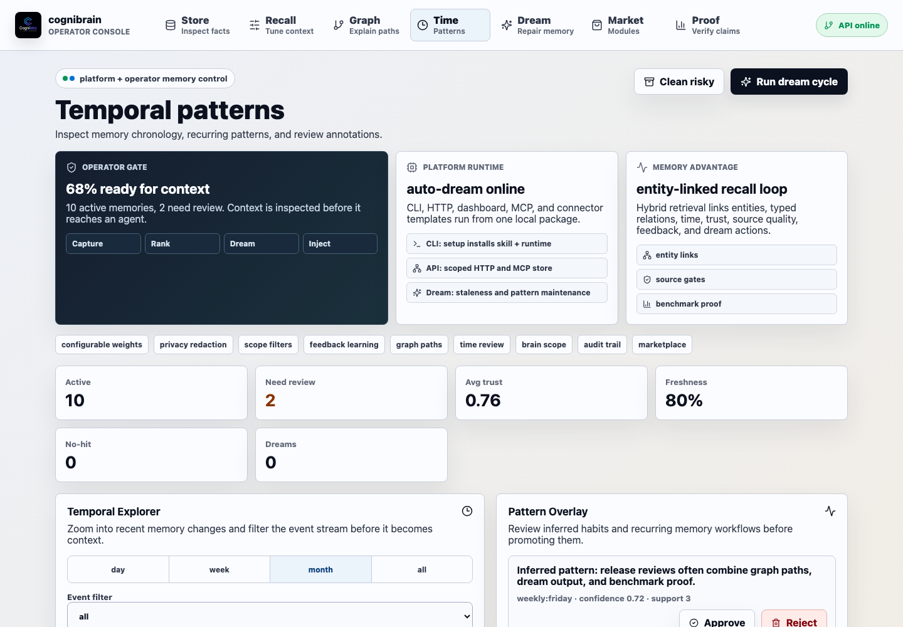
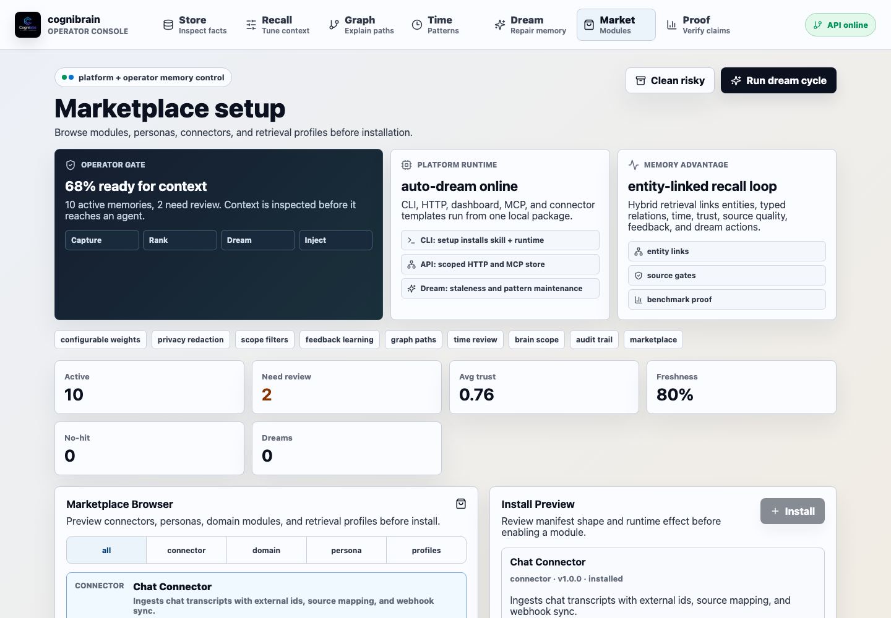
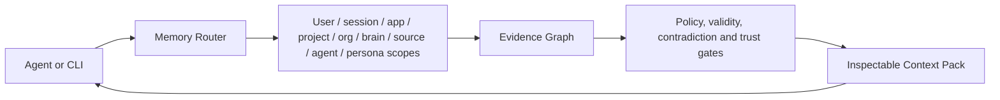

<p align="center">
  
</p>

<h1 align="center">cognibrain</h1>

<p align="center">
  <strong>Stop fixing the same agent mistake twice.</strong>
</p>

<p align="center">
  <a href="#quick-start">Quick Start</a> ·
  <a href="#is-it-production-ready">Production Readiness</a> ·
  <a href="#proof">Proof</a> ·
  <a href="#architecture">Architecture</a> ·
  <a href="docs/README.md">Documentation</a> ·
  <a href="docs/implementation-status.md">Status Matrix</a> ·
  <a href="docs/claims.md">Claims</a>
</p>

cognibrain is a local-first TypeScript Engineering Memory OS for coding agents. It captures corrections, repo policies, architecture decisions, review feedback and tool outcomes as evidence-grade memory, then injects the right context before the next code change. It is still an Inspectable Agent Memory OS at the platform layer: every memory can be routed, governed, cited and audited before injection. It remembers across agent harnesses, proves every memory with source and retrieval evidence, explains why context was selected, respects scope and consent boundaries, and keeps memory valid over time through graph, temporal, contradiction and dream-maintenance surfaces.

The project includes the memory engine, HTTP API, CLI, official connector manifests, 19 native vendor drivers across code, chat, docs, task, incident, observability and product systems, provider adapters, MCP connector, harness hook, operator dashboard, benchmark suite, and a self-maintenance loop called `dream`.

**Claim:** coding-agent memory you can prove, route, govern, benchmark, and reuse across every agent. Claim IDs: `CB-CLAIM-CONTEXT`, `CB-CLAIM-EVIDENCE`, `CB-CLAIM-PATCH-EVIDENCE`.

**USP:** Stop fixing the same agent mistake twice.

Implementation status is tracked in [`docs/implementation-status.md`](docs/implementation-status.md), which separates local-ready surfaces from roadmap items so market claims stay tied to code, tests and exposed APIs.
Claim evidence is mapped in [`docs/claims.md`](docs/claims.md), so README, product, benchmark, and market statements stay tied to verifier output instead of aspirational copy.
Production setup and the exact claim boundary are documented in [`docs/production-readiness.md`](docs/production-readiness.md).

## Five-Minute Proof

```bash
npm install
./bin/cognibrain.mjs setup --self-hosted
./bin/cognibrain.mjs memory action "pnpm test failed because this repo uses npm test"
MEMORY_PREVIOUS_WRONG_ACTION="pnpm test" MEMORY_CORRECT_ACTION="npm test" ./bin/cognibrain.mjs memory code-correction "Do not use pnpm in this repo; use npm test."
./bin/cognibrain.mjs memory evidence-pack "What command should I run before release?"
./bin/cognibrain.mjs memory action-guard "pnpm test"
./bin/cognibrain.mjs memory patch-evidence "release validation"
```

Replayable demo artifacts for the same loop:

```bash
npm run demo:why-used
npm run demo:cognicodebench
npm run demo:github-review
npm run demo:first-win
```

The demos generate `artifacts/demos/why-used.json`, `artifacts/demos/cognicodebench-demo-replay.json`, `artifacts/demos/github-review.json` and `artifacts/demos/first-win.json`, which are checked by `npm run audit:plan1_5`.

CogniCodeBench is the flagship benchmark for this loop: mistake -> correction -> memory -> next patch -> correct action. The checked-in artifact is synthetic proof, not a claim about arbitrary customer repositories. See [`docs/benchmarks/cognicodebench.md`](docs/benchmarks/cognicodebench.md), [`docs/benchmarks/results.md`](docs/benchmarks/results.md), and [`docs/claims.md`](docs/claims.md).

Benchmark Arena is the same-benchmark comparison runner: one synthetic engineering-memory scenario stream across Cognibrain, Mem0, Graphiti/Zep, Cognee, LangMem and GBrain with explicit proof levels. Run `npm run benchmark:arena`; read [`docs/benchmarks/arena.md`](docs/benchmarks/arena.md), [`docs/benchmarks/proof-levels.md`](docs/benchmarks/proof-levels.md), and [`docs/market/same-benchmark.md`](docs/market/same-benchmark.md). Competitor rows are local API-shape adapters unless an imported artifact says otherwise.


## Interface Tour

| Memory workbench | Recall QA |
| --- | --- |
|  |  |

| Temporal patterns | Marketplace setup |
| --- | --- |
|  |  |

| Dream cycle | Benchmark proof |
| --- | --- |
|  |  |

## Why Agent Memory OS

Agent memory often fails in one of two ways: it is either a simple vector search that misses time, trust, consent and contradictions, or a vague long-term summary that cannot be audited. cognibrain is built as a memory operating system: compact enough to use, structured enough to inspect, governed enough for teams, and measurable enough to improve.

The core question is not just “can the agent remember?” It is:

- What is known, who owns it, and where did it come from?
- Is it still valid now, or stale, contradicted, private, or superseded?
- Why was this memory retrieved for this task?
- Which graph path, temporal signal, trust score, source citation, consent rule, and retrieval profile allowed it into context?
- Can the same memory be reused safely across Codex, Claude Code, Cursor, Copilot, MCP and HTTP workflows?



That makes cognibrain different from narrower memory products:

| Product category | Main promise | cognibrain position |
| --- | --- | --- |
| Drop-in memory API like Mem0 | Store and recall user facts quickly | Adds inspectable context packs, governance, graph paths, lifecycle state, local ownership and harness routing |
| Personal markdown brain like GBrain | User-owned notes and backlinks | Adds API-first multi-agent/team scopes, consent enforcement, benchmarks, connectors and dashboard operations |
| Temporal graph memory | Conversation graph over time | Adds source-quality gates, evidence export, marketplace modules, compliance surfaces and local-first packaging |
| Graph/vector control plane | Hybrid retrieval over knowledge | Adds “why-used” proof, dream maintenance, policy-aware context injection and cross-harness reuse |

The short version: **cognibrain remembers across agents, proves every memory, explains every retrieval, respects every boundary, and learns from every correction, review, command, and codebase change.**

## Is It Production Ready?

For an open-source launch, yes: cognibrain is ready to present as a **self-hosted production candidate** when the verification gates pass in the target environment. That means the repo includes the core engine, Engineering Memory object model, API, CLI, MCP surface, dashboard, official connector manifests, real external vendor drivers, guided install state, durable storage adapters, Docker/Kubernetes starter artifacts, CogniCodeBench and Benchmark Arena gates, MIT license, contribution guide, security policy, and a status matrix that ties claims to code.

The boundary is explicit. Local development can run with JSON storage and no keys. Team or networked use must set `MEMORY_REQUIRE_AUTH=true`, configure `MEMORY_API_KEYS`, use a durable backend such as `postgres-remote` or SQLite for a single-node local team install, put TLS in front of the API, configure vendor credentials for source integrations, and run the publish checks. Managed SaaS readiness, tenant-specific vendor certification, and vendor-hosted competitor benchmark leadership are deployment-specific claims, not automatic README claims.

Production gates:

```bash
npm run verify:nextgen
npm run verify:status
npm run audit:plan1_3
npm run benchmark:cognicode
npm run benchmark:arena
npm run verify:postgres
npm run verify:connectors
npm run verify:vendor-connectors
./bin/cognibrain.mjs doctor --publish
npm run audit:plan1_5
npm pack --dry-run
```

See [`docs/production-readiness.md`](docs/production-readiness.md) for the deploy tiers, required environment, backup/export checks, connector proof scope, and release checklist.

## Dashboard

The dashboard is a working inspection surface, not a decorative demo. It presents cognibrain as a platform runtime plus an operator gate:

| Section | Why it exists |
| --- | --- |
| Operator gate | Shows whether context is ready before an agent can use it. |
| Platform runtime | Shows that CLI, HTTP, dashboard, MCP, and templates run from one local package. |
| Memory advantage | Explains the current USP: entity-linked hybrid recall plus dream maintenance. |
| Health metrics | Shows whether the memory store is fresh, trusted, and active. |
| Recall QA | Lets a user test the exact context an agent would receive. |
| Knowledge graph | Shows entity paths, source filters, activation, and graph clusters. |
| Temporal patterns | Lets operators zoom timelines, filter events, approve inferred patterns, and stage annotations. |
| Dream cycle | Proves memory hygiene by summarizing, fading, reflecting, and reorganizing facts. |
| Ranked evidence | Exposes score, citation, and trust for each retrieved memory. |
| Marketplace setup | Previews connectors, personas, domain modules, and retrieval profiles before install. |
| Benchmark evidence | Keeps local and public market proof visible. |
| Artifact inspector | Lets benchmark JSON be checked without leaving the UI. |

## Quick Start

Requirements:

- Node.js 20 or newer
- npm

One command from this checkout:

```bash
./bootstrap.sh --self-hosted
```

Guided install:

```bash
npx cognibrain init
npx cognibrain config show --json
npx cognibrain connector add github --set repo=cognilabz/cognibrain
npx cognibrain adapter add storage-sqlite --set path=.cognibrain/memory.sqlite
npx cognibrain sdk platform acme --kind project_management --out integrations/acme
npx cognibrain skill status
npx cognibrain doctor --fix
```

The setup CLI uses a React/Ink terminal flow when a real terminal is available and a deterministic text path for CI. Setup state, harness config, connector config, adapter config, Platform SDK scaffolds and the Codex Skill lifecycle are all reachable through CLI commands. See [`docs/getting-started/setup-cli.md`](docs/getting-started/setup-cli.md) and [`docs/tutorials/platform-sdk.md`](docs/tutorials/platform-sdk.md).

Five-minute Memory OS demo:

```bash
npm install
./bin/cognibrain.mjs setup --all-harnesses
./bin/cognibrain.mjs memory add "Atlas releases require npm test before publish."
./bin/cognibrain.mjs memory evidence-pack "What should Atlas do before release?"
./bin/cognibrain.mjs doctor
```

Or use the CLI directly:

```bash
npm install
./bin/cognibrain.mjs setup --self-hosted
```

When installed from the npm package, the same one-click path is:

```bash
npx cognibrain setup --self-hosted
npx cognibrain-connect claude-code
npx cognibrain-connect codex --no-start
npx cognibrain-connect opencode --no-start
npx cognibrain-connect langgraph --no-start
npx cognibrain-connect crewai --no-start
npx cognibrain-connect all
```

Python clients can use the dependency-free SDK in [`sdk/python`](sdk/python):

```python
from cognibrain_client import CognibrainClient

client = CognibrainClient(api_key="dev-secret", actor_id="codex")
pack = client.evidence_pack({"userId": "dev", "query": "release checklist"})
print(pack["context"])
```

`setup --self-hosted` installs the Codex Skill, writes MCP/config/helper packages for Codex, Claude Code, Cursor, GitHub Copilot, VS Code, OpenCode, OpenClaw, LangGraph, and CrewAI, starts the API plus dashboard, and runs the publish doctor.
`cognibrain-connect` is the dedicated package-style connector installer: it writes the same reviewable harness package manifest, starts the local API/dashboard unless disabled, and prints the publish doctor command so teams can verify connector health after installation.

Then open the printed dashboard URL. Runtime and publish helpers:

```bash
./bin/cognibrain.mjs status
./bin/cognibrain.mjs doctor --publish
./bin/cognibrain.mjs stop
./bin/cognibrain.mjs skill install
./bin/cognibrain.mjs clean
```

Managed/export checks:

```bash
MEMORY_BACKUP_REF=local-backup://2026-05 MEMORY_SSO_PROVIDER=oidc MEMORY_SECRET_MANAGER=vault ./bin/cognibrain.mjs memory migration-export managed > managed-bundle.json
./bin/cognibrain.mjs memory backup-verify managed-bundle.json
MEMORY_DEPLOYMENT_MODE=managed MEMORY_PUBLIC_URL=http://memory.example.com ./bin/cognibrain.mjs doctor --publish
```

## Usage

Add a memory:

```bash
./bin/cognibrain.mjs memory add "Project Atlas uses TypeScript for all harness components."
```

Search memory:

```bash
./bin/cognibrain.mjs memory search "What language does Atlas use?"
./bin/cognibrain.mjs memory inspect <memory-id>
./bin/cognibrain.mjs memory route "Which release memory should Codex use?"
./bin/cognibrain.mjs memory intent "How are Atlas and Redis connected?"
```

Explain why memories were used and export the same evidence an agent would receive:

```bash
./bin/cognibrain.mjs memory why-used "Why should Atlas run tests before release?"
./bin/cognibrain.mjs memory evidence-pack "Why should Atlas run tests before release?"
./bin/cognibrain.mjs memory evidence <context-pack-id>
```

The returned evidence pack is the first-five-minutes proof surface: it contains the compact context block plus per-memory source citation, consent boundary, scope, validity window, stale/decision state, retrieval signals, graph paths and reason phrases. Evidence packs are stored by `ctx_*` id, reloadable through `memory evidence <context-pack-id>`, and available through `POST /evidence-pack`, `GET /evidence-pack/:id`, and MCP `memory_context_pack`, so CLI, dashboard and harness integrations can all answer: “why was this memory used?”

Export the signable audit chain and replay memory lifecycle state:

```bash
./bin/cognibrain.mjs memory audit-chain
curl http://localhost:8787/audit/chain
```

Extract add-only memories from an event or conversation:

```bash
./bin/cognibrain.mjs memory extract "Atlas now uses Redis for cache. Verified npm test passed."
./bin/cognibrain.mjs memory action "npm run test"
./bin/cognibrain.mjs memory episodes
```

Give retrieval feedback:

```bash
./bin/cognibrain.mjs memory feedback <memory-id> helpful
./bin/cognibrain.mjs memory feedback-injection "release graph proof" accepted <good-id>,<bad-id> '{"graph":0.9,"trust":0.8}' <good-id> <bad-id>
./bin/cognibrain.mjs memory metrics
```

Run the maintenance cycle:

```bash
./bin/cognibrain.mjs memory dream
./bin/cognibrain.mjs memory verify
./bin/cognibrain.mjs memory confirm <memory-id>
./bin/cognibrain.mjs memory retract <memory-id> "Superseded by confirmed source"
./bin/cognibrain.mjs memory dream-policy
MEMORY_PERSIST_OBSERVATIONS=true ./bin/cognibrain.mjs memory observations
./bin/cognibrain.mjs memory predictions "Friday release review"
```

Inspect connectors and ingest a connector event:

```bash
./bin/cognibrain.mjs memory connectors
./bin/cognibrain.mjs memory connector-sync official-chat "Support confirmed the release note owner."
```

Translate or ingest a media transcript with language metadata:

```bash
MEMORY_LANGUAGE=de ./bin/cognibrain.mjs memory translate "Speicher soll nicht fehler"
MEMORY_MEDIA_TYPE=audio MEMORY_LANGUAGE=de ./bin/cognibrain.mjs memory media-ingest "Speicher soll release notes erfassen."
OCR_TEXT=$(tr '\n' ' ' < fixtures/media/operator-dashboard.ocr.txt)
MEMORY_MEDIA_TYPE=image MEMORY_SOURCE_URI=file://$PWD/fixtures/media/operator-dashboard.png MEMORY_MIME_TYPE=image/png MEMORY_METADATA_JSON="{\"ocrText\":\"$OCR_TEXT\",\"imageLabels\":[\"dashboard\",\"connector health\"]}" ./bin/cognibrain.mjs memory media-ingest "fixtures/media/operator-dashboard.png"

PDF_OCR_TEXT=$(tr '\n' ' ' < fixtures/media/operator-brief.ocr.txt)
MEMORY_MEDIA_TYPE=document MEMORY_SOURCE_URI=file://$PWD/fixtures/media/operator-brief.pdf MEMORY_MIME_TYPE=application/pdf MEMORY_METADATA_JSON="{\"ocrText\":\"$PDF_OCR_TEXT\"}" ./bin/cognibrain.mjs memory media-ingest "fixtures/media/operator-brief.pdf"
```

Check health:

```bash
./bin/cognibrain.mjs memory health
```

Check automatic maintenance:

```bash
./bin/cognibrain.mjs memory maintenance
```

## API

Create a memory:

```bash
curl -X POST http://localhost:8787/memories \
  -H "content-type: application/json" \
  -d '{
    "userId": "dev",
    "content": "Project Atlas uses TypeScript for all harness components.",
    "source": {"kind": "human", "confidence": 0.96},
    "tags": ["project", "typescript"]
  }'
```

Search:

```bash
curl -X POST http://localhost:8787/search \
  -H "content-type: application/json" \
  -d '{"userId": "dev", "appId": "codex", "query": "What language should Atlas use?", "limit": 5}'
```

Dream:

```bash
curl -X POST http://localhost:8787/dream \
  -H "content-type: application/json" \
  -d '{"userId": "dev"}'
```

Inspect connector/provider status and sync connector events:

```bash
curl http://localhost:8787/connectors
curl "http://localhost:8787/connectors/health"
curl http://localhost:8787/providers
curl "http://localhost:8787/connectors/list?connectorId=official-chat"
curl -X POST http://localhost:8787/connectors/sync \
  -H "content-type: application/json" \
  -d '{"connectorId":"official-chat","userId":"dev","events":[{"role":"user","content":"Support confirmed the release note owner.","externalId":"msg-1"}]}'
curl -X POST http://localhost:8787/connectors/writeback \
  -H "content-type: application/json" \
  -d '{"connectorId":"official-code","operation":"comment","target":{"repo":"cognilabz/cognibrain","path":"README.md","pullRequest":99},"content":"Memory-backed release decision summary.","dryRun":true}'
```

## Memory Lifecycle

The `dream` cycle is the self-maintenance loop for the memory store:

- Rethink repeated or contradictory memories.
- Reevaluate source confidence, usage, and open verification work.
- Summarize repeated themes into auditable reflection memories.
- Fade stale low-utility memories.
- Reflect on contradictions and demote weaker claims.
- Reorganize procedures, transcripts, and stable facts into better layers.

Pinned memories are never faded or archived.

The current runtime also supports configurable and scoped learned retrieval profiles, injection-feedback learning from accepted/rejected context packs, adaptive dream-policy previews, generated observations with citation provenance, behavioral prediction and prefetch reports, deterministic answer-generation/multi-hop/temporal/pattern benchmark suites, scoped retention rules with search/dream enforcement, encrypted-memory key id/version metadata, key-provider reporting, encrypted backup recovery verification, transport-security readiness checks, managed import/export deployment bundles, differentially private aggregate insights with k-anonymity suppression, validated marketplace install plans, TypeScript and Python client surfaces plus OpenAPI for code generation, packaged domain modules, JSON/JSONL/SQLite/Postgres persistence adapters, `hybrid`/`rrf`/`graph`/`path` retrieval modes, deterministic or provider-backed query expansion, behavioural retrieval scoring, contradiction-aware context selection, graph path/activation/export reasoning, JSON-command intelligence adapters, deterministic fallback reranking, verifier/summarizer/classifier/extractor/translator providers, official connector manifests, built-in native vendor API drivers for GitHub, GitLab, Azure DevOps, Slack, Discord, Teams, Jira, Confluence, Notion, Linear, Gmail, Google Drive, Google Calendar, Asana, ClickUp, Sentry, Datadog, PagerDuty and PostHog, connector sync records, webhook delivery/retry inspection, scoped memory (`sessionId`, `appId`, `orgId`, `projectId`), multi-tenant brains/sources with explicit shared-brain federation, agent subscriptions, shared-memory review/revoke workflows, persona defaults, consent mutation, audit history and revert, offline operation queues, explicit identity links, privacy consent flags, secret redaction/encryption, canonical entity records with merge/split suggestions, typed relations, staged add-only extraction with media/language envelopes, translated media ingestion, enrichment candidates, hour/day/week/month temporal timelines, persisted timeline summaries, multilingual contradiction checks, behavioral-pattern review, feedback-based trust/importance updates, domain evaluations, local metrics, lifecycle preview, and export/delete APIs.

For coding agents, the runtime also includes first-class Engineering Memory types (`repo_policy`, `architecture_decision`, `review_correction`, `tool_outcome`, `procedure`, `forbidden_action`, `migration_note`, `test_strategy`, `dependency_rule`, `generated_file_rule`), repo/branch/package/file scope, coding context packs, action guards, patch evidence trails, and CogniCodeBench.

## Connectors

cognibrain exposes four integration surfaces. The CLI is the primary install and runtime surface; MCP is available for compatible agent clients without making MCP the only way to operate the platform.

- HTTP API for apps and services,
- CLI for local scripts,
- TypeScript harness hook for direct agent runtimes,
- stdio MCP server for MCP-compatible tools.

Start MCP:

```bash
./bin/cognibrain.mjs mcp
MCP_PORT=8788 ./bin/cognibrain.mjs mcp --http
```

Available MCP tools:

- `memory_add`
- `memory_search`
- `memory_context_pack`
- `memory_evidence_pack`
- `memory_coding_context_pack`
- `memory_code_correction`
- `memory_action_guard`
- `memory_patch_evidence`
- `memory_list`
- `memory_reflect`
- `memory_dream`
- `memory_health`
- `memory_maintenance_status`
- `memory_policy_check`
- `memory_retention_review`
- `memory_verify_claim`
- `memory_graph_path`
- `memory_graph_query`
- `memory_graph_activate`
- `memory_explain_connection`
- `memory_procedure_recall`
- `memory_action_record`
- `memory_action_outcome`

Connector templates are included for Claude Code, Codex, GitHub Copilot, Cursor, VS Code, OpenCode, OpenClaw, LangGraph, and CrewAI under `templates/`. The direct TypeScript harness hook now covers the full connector loop: session-start context, pre-tool procedure recall and action guard, post-tool outcome memory, user correction capture, and patch evidence trail.

## Proof

Local verification:

```bash
npm run verify
```

Next-generation feature verification:

```bash
npm run verify:nextgen
```

Certified benchmark gate:

```bash
npm run benchmark:certified
```

Engineering-memory benchmark:

```bash
npm run benchmark:cognicode
```

Public market-claim gate:

```bash
npm run benchmark:market -- --competitors docs/public-market-claims.json --out artifacts/market-gate-public.json
```

Latest checked evidence:

<!-- benchmark-claims:start -->
| Dataset | cognibrain | Result |
| --- | ---: | --- |
| LoCoMo | `34/40`, `85.00%` | Beats keyword-only `67.50%` |
| LongMemEval-S | `40/40`, `100.00%` | Saturates with keyword-only `100.00%` |
<!-- benchmark-claims:end -->

The public market gate is a public-claim comparison, not a vendor-signed rerun. Stronger commercial proof imports vendor artifacts with the same dataset, metric, top-K, and budget.

CogniCodeBench is the coding-agent proof: 100 deterministic synthetic repo scenarios measure whether corrections, review feedback, commands, tool outcomes and migrations carry into the next patch. See [`docs/benchmarks/cognicodebench.md`](docs/benchmarks/cognicodebench.md).

## Architecture

```text
src/core/          Memory model, store, graph reasoning, retrieval, reflection, health
src/api/           Node HTTP API and service facade
src/cli/           memctl command line interface
src/connectors/    Harness hook, MCP handlers, MCP server
src/dashboard/     React dashboard
src/eval/          Benchmark runners, fixtures, baselines, market gate, leaderboard artifacts
tests/             Vitest tests for core behavior and evaluation proof
templates/         Connector starter templates
docs/              Setup, API, lifecycle, connector, and benchmark docs
docker/            Container and compose files
```

## Documentation

- [Docs Home](docs/README.md)
- [Quickstart](docs/getting-started/quickstart.md)
- [First Engineering Memory](docs/getting-started/first-engineering-memory.md)
- [Product Overview](docs/getting-started/overview.md)
- [Setup CLI](docs/getting-started/setup-cli.md)
- [Canonical Messaging](docs/marketing/messaging.md)
- [Launch Narrative](docs/marketing/launch-narrative.md)
- [API Reference](docs/api-reference.md)
- [Agent Memory OS](docs/agent-memory-os.md)
- [Configuration](docs/configuration.md)
- [Production Readiness](docs/production-readiness.md)
- [Production Overview](docs/production/overview.md)
- [Release Checklist](docs/production/release-checklist.md)
- [Integration Guide](docs/integration-guide.md)
- [MCP Integration](docs/integrations/mcp.md)
- [Codex Integration](docs/integrations/codex.md)
- [GitHub Connector](docs/integrations/github.md)
- [Jira, Confluence, Notion And Linear](docs/integrations/jira-confluence-notion-linear.md)
- [Memory Lifecycle](docs/lifecycle.md)
- [Connectors](docs/connectors.md)
- [Connector Maturity Matrix](docs/connectors.md#connector-maturity-matrix)
- [Benchmarking](docs/benchmarking.md)
- [CogniCodeBench](docs/benchmarks/cognicodebench.md)
- [CogniCodeBench Results](docs/benchmarks/results.md)
- [Benchmark Arena](docs/benchmarks/arena.md)
- [Benchmark Proof Levels](docs/benchmarks/proof-levels.md)
- [Benchmark Landscape](docs/benchmarks/landscape.md)
- [Open Benchmark Leaderboard](docs/leaderboard.md)
- [Community And Adoption](docs/community.md)
- [Partner Integration Playbook](docs/partners.md)
- [One-Click Local Tutorial](docs/tutorials/one-click-local.md)
- [Connector Authoring Tutorial](docs/tutorials/connector-authoring.md)
- [Graph, Time, And Pattern Tutorial](docs/tutorials/graph-temporal-patterns.md)
- [Privacy And Retention Tutorial](docs/tutorials/privacy-retention.md)
- [Domain Module Tutorial](docs/tutorials/domain-module.md)
- [Market Comparison](docs/market-comparison.md)
- [Same Benchmark, No Slogan](docs/market/same-benchmark.md)
- [Compare: Mem0](docs/compare/mem0.md)
- [Compare: GBrain](docs/compare/gbrain.md)
- [Compare: Hindsight](docs/compare/hindsight.md)
- [Compare: Zep](docs/compare/zep.md)
- [Compare: Cognee](docs/compare/cognee.md)
- [Market Analysis Implementation Audit](docs/market-analysis-implementation-audit.md)
- [Advanced Features](docs/advanced-features.md)
- [Roadmap](docs/roadmap.md)

## Open-Source Readiness

This repository is prepared as a public Cognilabz project:

- MIT license,
- reproducible install and verification commands,
- CI workflow,
- Docker Compose and Kubernetes starter files for authenticated self-hosted deployments,
- contribution guide,
- security policy,
- dashboard screenshots,
- product positioning and production-readiness docs,
- generated benchmark artifacts kept out of source control under `artifacts/`.

## Contributing

Start with:

```bash
npm install
npm run verify
```

Before opening a change, run:

```bash
npm run test
npm run build
```

For benchmark-related changes, run the relevant benchmark command and update documentation only from generated artifacts.

CI runs the synthetic evaluation artifact and public-safe leaderboard artifact on every push and pull request. Weekly or manually triggered CI runs execute the certified benchmark gate and upload the generated proof artifacts.

## Safety

Do not store secrets, private keys, raw credentials, medical records, or sensitive transcripts unless your project has an explicit retention policy. Connectors should default to project-local scope and explicit user consent for durable storage.
