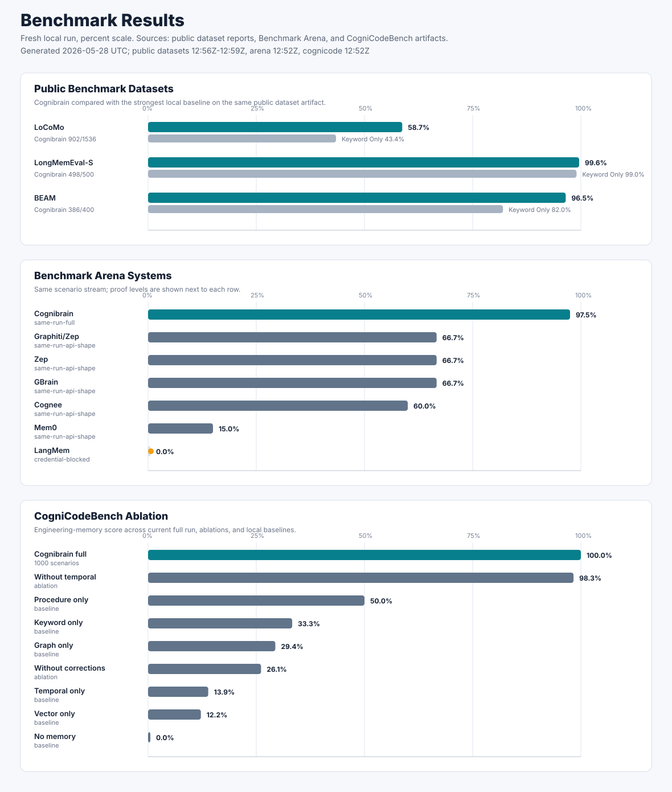

# Benchmark Results

This page records the current checked benchmark artifacts. It is a results
snapshot, not a how-to guide.

## Artifact Snapshot

| Artifact | Generated | Result |
| --- | --- | --- |
| `artifacts/nextgen-benchmarks.json` | 2026-05-28T12:52:13.044Z | Passed |
| `artifacts/cognicodebench/run.json` | 2026-05-28T12:52:18.714Z | Passed |
| `artifacts/arena/run.json` | 2026-05-28T12:52:32.574Z | Passed |
| `artifacts/answer-generation.json` | 2026-05-28T12:52:33.568Z | Passed |
| `artifacts/leaderboard.json` | 2026-05-28T12:52:33.985Z | Passed |
| `artifacts/benchmark-hardening.json` | 2026-05-28T12:52:34.422Z | Passed |
| `artifacts/locomo-report.json` | 2026-05-28T12:56:23.302Z | Passed |
| `artifacts/longmemeval-report.json` | 2026-05-28T12:59:05.579Z | Passed |
| `artifacts/beam-report.json` | 2026-05-28T12:59:37.944Z | Passed |
| `artifacts/beam-500k-report.json` | 2026-05-28T13:25:02.636Z | Passed |
| `artifacts/beam-1m-report.json` | 2026-05-28T13:30:39.115Z | Passed |

## Public Benchmark Datasets

| Dataset | Metric | Cognibrain | Strongest local baseline |
| --- | --- | ---: | ---: |
| LoCoMo | Evidence recall@K | 58.7% (902/1536) | Keyword only 43.4% |
| LongMemEval-S | Answer-session recall@K | 99.6% (498/500) | Keyword only 99.0% |
| BEAM 100K | Retrieval nugget score@K | 96.5% (386/400) | Keyword only 82.0% |
| BEAM 500K | Retrieval nugget score@K | 97.7% (684/700) | Keyword only 79.1% |
| BEAM 1M | Retrieval nugget score@K | 94.6% (662/700) | Keyword only 82.1% |

## CogniCodeBench

| Metric | Result |
| --- | ---: |
| Scenarios | 1000 |
| Correction carry-over | 100.0% |
| Repeated mistake rate | 0.0% |
| Procedure recall | 100.0% |
| Patch correctness | 100.0% |
| Evidence completeness | 100.0% |
| Wrong-memory suppression | 100.0% |
| Source-reference correctness | 100.0% |
| Granular patch correctness | 100.0% |
| Long-horizon recall | 100.0% |

## Baselines

| Baseline | Score | Repeated mistake rate |
| --- | ---: | ---: |
| No memory | 0.0% | 100.0% |
| Raw chat history | 0.0% | 100.0% |
| Vector only | 12.2% | 100.0% |
| Semantic only | 12.2% | 100.0% |
| Keyword only | 33.3% | 75.0% |
| Graph only | 29.4% | 85.0% |
| Temporal only | 13.9% | 95.0% |
| Procedure only | 50.0% | 90.0% |
| Cognibrain without temporal | 98.3% | 0.0% |
| Cognibrain without corrections | 26.1% | 90.0% |

## Arena

| System | Proof level | Mode | Scenarios | Score |
| --- | --- | --- | ---: | ---: |
| Cognibrain | `same-run-full` | `full-local` | 300 | 97.5% |
| Graphiti/Zep | `same-run-api-shape` | `api-shape` | 300 | 66.7% |
| Zep | `same-run-api-shape` | `api-shape` | 300 | 66.7% |
| GBrain | `same-run-api-shape` | `api-shape` | 300 | 66.7% |
| Cognee | `same-run-api-shape` | `api-shape` | 300 | 60.0% |
| Mem0 | `same-run-api-shape` | `api-shape` | 300 | 15.0% |
| LangMem | `credential-blocked` | `blocked-command` | 300 | 0.0% |

## Hardening

| Check | Result |
| --- | --- |
| Scenario dataset present | Pass |
| Scenario schema present | Pass |
| Dataset hash present | Pass |
| Scenario generation pinned | Pass |
| Real-repo track present | Pass |
| Real-repo workflows present | Pass |
| Competitor proof levels bounded | Pass |
| Native competitor path exists | Pass |

Dataset: `artifacts/cognicodebench/scenarios.json`

SHA-256:
`aec0cf11b1e07a11b4cc090509b36b73809d67fee19ccbe8e5667463746a17fb`
