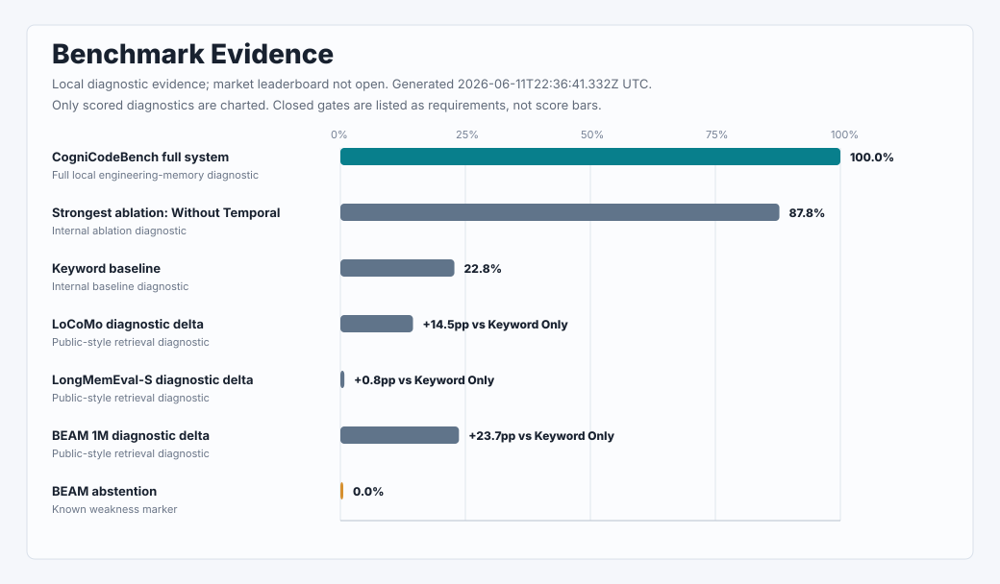

# Benchmark Evidence

_Last generated: 2026-06-11T22:36:41.332Z UTC_  
_Current claim level: Local diagnostic evidence_  
_Market leaderboard: Not open_

Honest evidence for Cognibrain's engineering-memory loop. Current public status: local diagnostic evidence, no market leaderboard claim yet.

| Status | Current answer |
| --- | --- |
| Current claim level | Local diagnostic evidence |
| What is supported | Strong local evidence for coding-agent engineering-memory workflows. |
| What is not supported | No public best-product claim, no market leaderboard, no BEAM quality claim. |
| Next gate | Same-protocol judged runs with original competitor systems, raw outputs, hashes, and replication. |

## Current Verdict

Cognibrain currently has strong local diagnostic evidence for engineering-memory workflows: repeated-mistake prevention, correction carry-over, patch evidence, source-aware recall, stale-memory suppression, and guard behavior.

It does not yet publish a fair market leaderboard against original competitor systems. The current page proves a focused engineering-memory loop, not market leadership.

## Evidence Matrix

| Question | Best current evidence | Result | Claim status | Limitation |
| --- | --- | --- | --- | --- |
| Can Cognibrain prevent repeated coding-agent mistakes in controlled repo-like workflows? | CogniCodeBench | 1,000 scenarios; 100.0% diagnostic score; 96.0% integrity | L1 Local diagnostic | Synthetic/internal; not market comparison |
| Can it retrieve relevant memory on public-style long-memory tasks? | LoCoMo / LongMemEval-S / BEAM stress | LoCoMo 57.9% vs Keyword Only 43.4%; LongMemEval-S 99.8% vs Keyword Only 99.0%; BEAM 51.3% vs Keyword Only 27.6% | L2 Public stress diagnostic | Retrieval signal only; not answer quality or competitor proof |
| Does it have known weaknesses? | BEAM weakness analysis | Abstention 0.0%; temporal and knowledge-update categories remain weak | Diagnostic weakness | Needs unsupported-question and temporal freshness work |
| Is a fair market benchmark ready? | Reality Bench / EMRP gate and real-world black-box harness | 9 harness slots; raw outputs and telemetry path present; market gate closed | L0 Gate closed | Missing same judge, original competitor command outputs, public hash, and replication |
| Is market leadership claimable? | Reality/EMRP claim gate | No | L0 Gate closed | Requires original competitor runs, shared judge traces, hashes, and independent replication |

## What The Numbers Mean

| Badge | Meaning | Can be used publicly as |
| --- | --- | --- |
| Claimable | Passed quality or market gate. | The exact bounded claim. |
| Diagnostic | Useful regression or stress evidence. | Internal/local evidence with the stated proof boundary. |
| Blocked / not scored | Setup, judge, credential, or protocol gate missing. | No result. It belongs in a gate or coverage table, not a score chart. |

Public labels are intentionally simple:

| Level | Public label | Meaning |
| --- | --- | --- |
| L0 | Not run / blocked | No result. Show the reason and next gate only. |
| L1 | Local diagnostic | Regression/product diagnostic; no market claim. |
| L2 | Public stress diagnostic | Public or public-style data; no fair competitor comparison. |
| L3 | Quality-judged evidence | Same judge, raw outputs, reproducible scoring traces. |
| L4 | Market-comparable | Original systems, same protocol and budgets, public hash, independent replication. |

## Key Results



Only scored diagnostic values appear in the chart. Closed gates and missing judge/setup states are represented below as requirements, not bars.

| Result | Value | Evidence | Boundary |
| --- | ---: | --- | --- |
| CogniCodeBench full system | 100.0% | `artifacts/cognicodebench/run.json` | Full local engineering-memory diagnostic |
| Strongest ablation: Without Temporal | 87.8% | `artifacts/cognicodebench/run.json` | Internal ablation diagnostic |
| Keyword baseline | 22.8% | `artifacts/cognicodebench/run.json` | Internal baseline diagnostic |
| LoCoMo diagnostic delta | +14.5pp vs Keyword Only | `artifacts/locomo-report.json` | Public-style retrieval diagnostic |
| LongMemEval-S diagnostic delta | +0.8pp vs Keyword Only | `artifacts/longmemeval-report.json` | Public-style retrieval diagnostic |
| BEAM 1M diagnostic delta | +23.7pp vs Keyword Only | `artifacts/beam-1m-report.json` | Public-style retrieval diagnostic |
| BEAM abstention | 0.0% | `artifacts/beam-1m-report.json` | Known weakness marker |

## Known Limits And Failures

- No market leaderboard yet: no same-protocol judged original-competitor run.
- BEAM abstention is currently 0.0% across tested splits.
- Temporal reasoning and knowledge-update retrieval are weak.
- Public dataset stress is retrieval evidence, not answer-quality proof.
- Arena/API-shape rows are internal capability diagnostics, not competitor results.

## Market Gate Status

| Requirement | Current state | Note |
| --- | --- | --- |
| Frozen manifest | Pass | Required before any market run. |
| Same input stream | Pass | Every eligible system must use the same manifest input stream. |
| Same judge traces | Missing | Missing for the current public status. |
| Original competitor command outputs | Missing | Need at least two eligible original competitor systems. |
| Raw outputs retained | Pass | Required for audit and replication. |
| Cost and latency recorded | Pass | Required for budget fairness. |
| Public artifact hash | Missing | Missing for the current public status. |
| Independent replication hash | Missing | Missing for the current public status. |
| Market leaderboard | Closed | Claim gate opens only when all evidence gates pass. |

## Reproduce / Artifacts

Minimal commands:

```bash
npm test
npm run build
npm run release:check
npm run benchmark:reality:run
npm run benchmark:reality:publish
npm run internal -- benchmark:summary
```

Generated summary artifacts:

- `artifacts/public/benchmark-summary.json`
- `artifacts/docs/benchmark-summary.md`
- `docs/assets/benchmark-summary.svg`
- `artifacts/cognicodebench/run.json`
- `artifacts/public/evidence-table/index.json`
- `artifacts/realworld-blackbox.json`
- `artifacts/locomo-report.json`
- `artifacts/longmemeval-report.json`
- `artifacts/beam-report.json`
- `artifacts/beam-500k-report.json`
- `artifacts/beam-1m-report.json`

Each visible number above is backed by a generated timestamp and artifact path. Raw outputs, scorer traces, manifest hashes, and full setup diagnostics stay in the generated artifacts until the market gate opens.

## Appendix

The former artifact snapshot, maintainer refresh map, Arena API-shape rows, native competitor smoke rows, original public benchmark blockers, and full raw tables are maintainer diagnostics. They remain available in `artifacts/` and generated benchmark reports, but they are not part of the public score surface while the market gate is closed.
