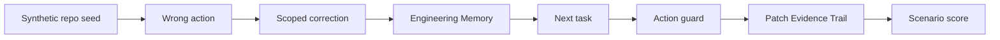

# CogniCodeBench

CogniCodeBench measures whether coding agents learn from codebase corrections, review feedback, commands, tool outcomes, generated-file traps and repo migrations before the next change.

It is synthetic by design. No private repository or user memory is included in the public artifact. The goal is not to claim broad coding ability; it is to prove one specific memory behavior: after an agent makes a mistake and receives a scoped correction, the next patch should use the corrected rule, avoid the repeated mistake, cite evidence, and suppress stale rules.

## Run

Generate deterministic scenarios:

```bash
npm run benchmark:cognicode:generate
```

Run the benchmark:

```bash
npm run benchmark:cognicode
```

Replay the concrete demo repo scenarios:

```bash
npm run demo:cognicodebench
```

Default artifacts:

- `artifacts/cognicodebench/scenarios.json`
- `artifacts/cognicodebench/run.json`
- `artifacts/demos/cognicodebench-demo-replay.json`
- `artifacts/plan1_2-audit.json` after `npm run audit:plan1_2`
- `artifacts/plan1_3-audit.json` after `npm run audit:plan1_3`
- `artifacts/leaderboard.json` after `npm run leaderboard`

## Scenario Format

The scenario schema is published at [`docs/schemas/cognicodebench-scenario.schema.json`](../schemas/cognicodebench-scenario.schema.json).
Five complete examples live in [`fixtures/cognicodebench/scenarios.example.json`](../../fixtures/cognicodebench/scenarios.example.json).

Each scenario contains:

- `repoSeed`: synthetic repo language, framework, branch, test command, generated files, hidden trap and file map.
- `wrongAction`: the first agent mistake, including command, files changed and failure reason.
- `correction`: the user or review correction stored as Engineering Memory.
- `nextTask`: the next coding task.
- `expected`: command, files, required memory kinds and stale or blocked behavior.

## Evaluation

For every scenario the runner:

1. Stores the wrong tool outcome.
2. Records a scoped code correction and supersedes the previous wrong action.
3. Builds a coding context pack with repo policies, procedures, corrections, architecture decisions, tool outcomes and temporal notes.
4. Runs the forbidden-action guard against the repeated mistake.
5. Builds a patch evidence trail.
6. Scores correction recall, procedure recall, wrong-action suppression, patch correctness, evidence completeness and stale-rule suppression.



## Baselines

The artifact includes measured synthetic ablation baselines. Each mode is replayed across the same scenario set with the named memory signal removed or isolated, then scored with the same correction, procedure, patch, evidence and stale-memory checks:

- `no_memory`
- `raw_chat_history`
- `keyword_only`
- `semantic_only`
- `vector_only`
- `graph_only`
- `temporal_only`
- `procedure_only`
- `cognibrain_without_temporal`
- `cognibrain_without_corrections`
- `cognibrain_full`

Claims should compare only these artifact scores unless an external system submits a comparable artifact with the same schema, scenario count and metric definitions.

## Latest Baseline Table

Generated from `artifacts/cognicodebench/run.json` in this checkout:

| Mode | Score | Correction carryover | Repeated mistake rate |
| --- | ---: | ---: | ---: |
| `no_memory` | `0.028` | `0` | `1` |
| `raw_chat_history` | `0.212` | `0.42` | `0.74` |
| `vector_only` | `0.31` | `0.42` | `1` |
| `semantic_only` | `0.31` | `0.42` | `1` |
| `keyword_only` | `0.585` | `0.67` | `0.5` |
| `graph_only` | `0.448` | `0.67` | `0.67` |
| `temporal_only` | `0.302` | `0.33` | `0.84` |
| `procedure_only` | `0.557` | `0.17` | `0.67` |
| `cognibrain_without_temporal` | `0.947` | `1` | `0` |
| `cognibrain_without_corrections` | `0.392` | `0` | `0.83` |
| `cognibrain_full` | `1` | `1` | `0` |

Claim IDs: `CB-CLAIM-COGNICODE`, `CB-CLAIM-ABLATION`.

## Passing Gate

The default gate requires:

- at least 100 generated scenarios,
- all scenario checks passing for `cognibrain_full`,
- at least five complete fixture examples,
- all plan1_3 ablation modes present,
- correction carryover at or above 0.90,
- repeated mistake rate at or below 0.05,
- procedure recall at or above 0.90,
- wrong-memory suppression at or above 0.90,
- full score above every included baseline.

## Engineering Memory Types

CogniCodeBench exercises the first-class coding memory kinds:

- `repo_policy`
- `architecture_decision`
- `review_correction`
- `tool_outcome`
- `procedure`
- `forbidden_action`
- `migration_note`
- `test_strategy`
- `dependency_rule`
- `generated_file_rule`

These are stored under `metadata.engineering`, scoped through `CodebaseScope`, exposed in coding context packs, and used by action guards and patch evidence trails.

## Real Demo Repo Scenarios

Synthetic benchmark scenarios are complemented by replayable demo briefs in [`../../fixtures/cognicodebench/demo-repos.json`](../../fixtures/cognicodebench/demo-repos.json):

- TypeScript API
- React app
- Python FastAPI service
- Monorepo
- Legacy app

Each demo includes a before task, wrong action, correction, next task and expected next action. These examples are still demo fixtures, not customer-production evidence.
Run `npm run demo:cognicodebench` to replay all five examples through the CLI and generate `artifacts/demos/cognicodebench-demo-replay.json`.

## Interpreting Results

A passed local run proves that the current checkout can execute the synthetic engineering-memory loop end to end. It does not prove that every real repository integration is configured. For production claims, also run:

```bash
npm run verify:nextgen
npm run verify:postgres
npm run verify:connectors
npm run verify:vendor-connectors
./bin/cognibrain.mjs doctor --publish
```
