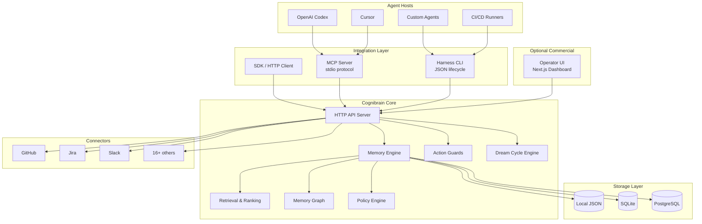
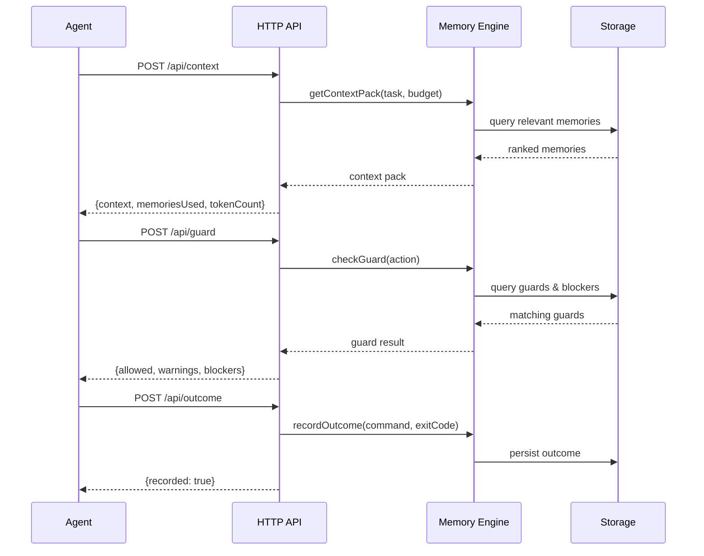
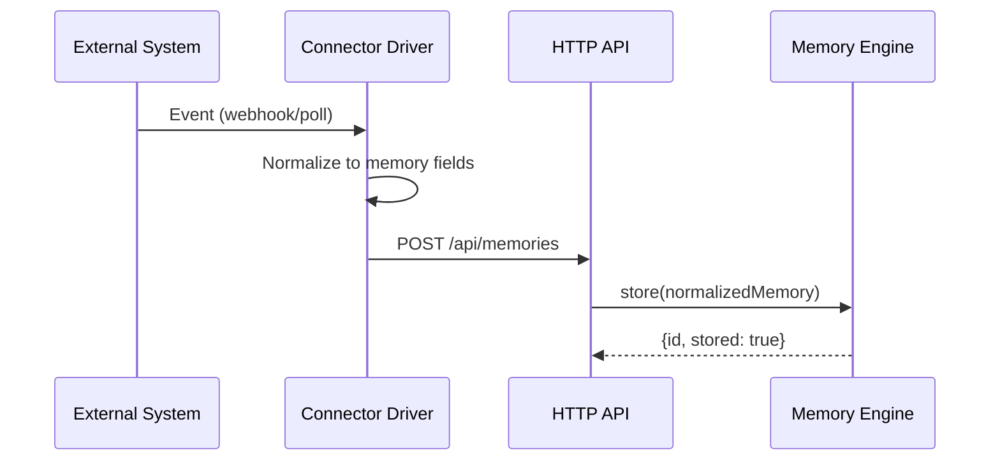

# Architecture

Cognibrain is designed as a local-first, self-hosted system with clear boundaries between its open-source core and optional commercial surface.

## System Overview

## Component Boundaries

### Integration Layer

The integration layer adapts different client protocols to the unified HTTP API:

| Component | Protocol | Consumers |
|-----------|----------|-----------|
| MCP Server | stdio (Model Context Protocol) | Codex, Cursor, MCP-native agents |
| Harness CLI | Shell process + JSON stdout | Any shell-capable agent, git hooks, CI |
| SDK/HTTP | REST over HTTP | Product integrations, dashboards, custom runtimes |

All three surfaces are stateless proxies — they translate requests into API calls and format responses for their protocol.

### Memory Engine

The core memory engine handles:

- **Storage**: CRUD operations on memory items
- **Retrieval**: Relevance-ranked context retrieval within token budgets
- **Graph**: Relationships between memories (supersedes, contradicts, relates-to)
- **Policy**: Scoping rules, access control, and governance
- **Guards**: Pre-action safety checks against stored knowledge

### Storage Layer

Pluggable storage backends:

| Backend | Use Case | Characteristics |
|---------|----------|-----------------|
| Local JSON | Solo development | Zero-config, file-based, fast startup |
| SQLite | Local durable | Single-file database, good for single-machine |
| PostgreSQL | Team/production | Full ACID, concurrent access, scalable |

### Dream Cycle Engine

Runs asynchronously to maintain memory health:

- Staleness detection
- Contradiction identification
- Summary consolidation
- Operator review queue management

### Connector System

Bidirectional integration with external systems:

- **Ingest**: Pull events from external systems → create memories
- **Emit**: Push memory-linked context back to external systems
- **Sync**: Bidirectional state synchronization

## Data Flow

### Agent Lifecycle Flow

### Connector Ingest Flow

## Design Principles

1. **Local-first**: Works fully offline on a single machine with no external dependencies
2. **Text-first**: CLI output is readable in small terminals, CI logs, and remote shells
3. **Daemon-optional**: Direct local access available for simple setups; daemon for production
4. **Surface-agnostic**: Same memory engine regardless of how you connect
5. **Evidence-backed**: Claims and benchmarks require artifact proof
6. **Operator-in-the-loop**: Automated maintenance surfaces items for human review, never auto-deletes
