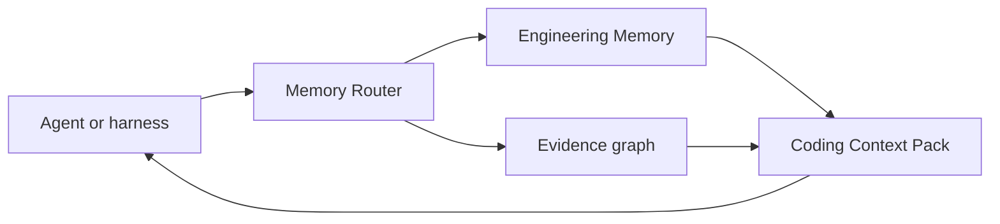

# Context Pack

Coding context packs turn Engineering Memory into agent-ready sections:

- relevant repo policies
- procedures before action
- previous corrections
- known pitfalls
- architecture decisions
- tool commands
- forbidden actions
- graph and temporal notes

High-impact stale or unsafe memories are excluded and recorded in the pack.

Claim IDs: `CB-CLAIM-CONTEXT`, `CB-CLAIM-EVIDENCE`.
