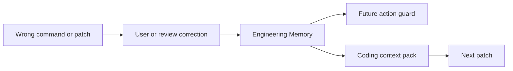

# Corrections

Corrections are first-class because they are the strongest signal that an agent previously did something wrong.

`recordCodeCorrection` stores the reviewed correction, supersedes the wrong action when a previous memory is supplied, and derives policy/procedure/forbidden-action memories when the text is actionable.

Claim IDs: `CB-CLAIM-CONTEXT`, `CB-CLAIM-GUARD`.
