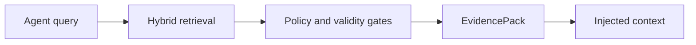

# EvidencePack

An EvidencePack is the canonical "why was this memory used?" artifact.

It includes selected memories, excluded memories, policy decisions, graph paths, temporal state, trust/confidence signals and source citations.

Claim ID: `CB-CLAIM-EVIDENCE`.
