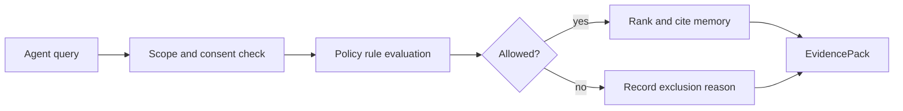

# Policy-Aware Retrieval

Retrieval is not only ranking. Before memory reaches an agent, cognibrain evaluates scope, consent, policy rules, temporal state, contradiction state and unsafe-to-inject confidence.

Denied or excluded memories appear in EvidencePacks so operators can see what was kept out.

Claim IDs: `CB-CLAIM-EVIDENCE`, `CB-CLAIM-PRODUCTION`.
