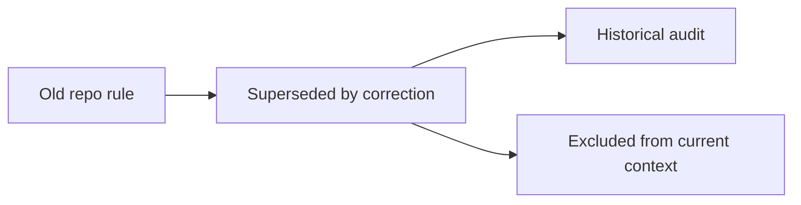

# Temporal Belief Graph

cognibrain tracks whether a memory is active, stale, superseded, contradicted, needs verification, retracted or archived.

Repo migrations and corrected rules use temporal metadata so an old instruction can remain available for audit without being injected into new work.

Claim IDs: `CB-CLAIM-EVIDENCE`, `CB-CLAIM-CONTEXT`.
