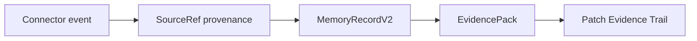

# Connectors

cognibrain is CLI-first and MCP-compatible.

The CLI is the human and automation surface: install, start, stop, status, health checks, memory commands, and CI-friendly scripting. MCP is the agent tool surface: let compatible harnesses retrieve, write, and inspect memory without shell parsing.

```bash
npx cognibrain init --profile team
npx cognibrain config show --json
npx cognibrain connector add github --set repo=cognilabz/cognibrain
npx cognibrain connector add jira --set baseUrl=https://example.atlassian.net --set project=ENG
npx cognibrain adapter add storage-postgres --url-env MEMORY_POSTGRES_URL
npx cognibrain skill status
npx cognibrain doctor --fix
```

For package-style harness install:

```bash
npx cognibrain-connect claude-code
npx cognibrain-connect all --no-start
./bin/cognibrain.mjs status
./bin/cognibrain.mjs memory search "project conventions"
./bin/cognibrain.mjs memory connectors
./bin/cognibrain.mjs mcp
```

This mirrors the current AI-tooling direction: make the install path a small memorable command, then let each harness opt into deeper integration.
The setup path uses a React/Ink terminal UI in interactive shells and writes deterministic JSON in CI. This is credential-safe connector setup: connector files keep non-secret choices and `env:` references only; token values stay in the environment.
All setup surfaces have a CLI command: `config` for harness paths and generated files, `connector` for source systems, `adapter` for storage/provider/benchmark/MCP transport contracts, and `skill` for the Codex Skill lifecycle.
`cognibrain-connect` is the npm-bin surface for that path. It accepts `codex`, `claude-code`, `cursor`, `github-copilot`, `vscode`, `opencode`, `openclaw`, `langgraph`, `crewai`, or `all`, delegates to the same setup engine, writes `.cognibrain-harness-package.json`, and prints a `doctor --publish` health command after installation.
`cognibrain-connect` also ships package-style setup for OpenCode, OpenClaw, LangGraph, and CrewAI. Those targets install MCP configs or helper files that fetch evidence packs and send tool-outcome telemetry through the same HTTP API.

Harness config commands:

```bash
./bin/cognibrain.mjs config list
./bin/cognibrain.mjs config show --json
./bin/cognibrain.mjs config paths
./bin/cognibrain.mjs config doctor
./bin/cognibrain.mjs config codex
./bin/cognibrain.mjs config claude
./bin/cognibrain.mjs config copilot
./bin/cognibrain.mjs config cursor
./bin/cognibrain.mjs config vscode
./bin/cognibrain.mjs config opencode
./bin/cognibrain.mjs config openclaw
./bin/cognibrain.mjs config langgraph
./bin/cognibrain.mjs config crewai
```

Generated harness packages call the packaged CLI with `--runtime-root <project>`, so an npm-installed package stores memory in the target project instead of inside `node_modules`. `setup --self-hosted` and `setup --all-harnesses` write:

- Codex: `~/.codex/config.toml`, `~/.codex/skills/cognibrain/SKILL.md`, and project `AGENTS.md`.
- Claude Code: project `.mcp.json` and `.claude/settings.json` hooks.
- GitHub Copilot: `.github/copilot-instructions.md` and `.github/instructions/cognibrain.instructions.md`.
- Cursor: `.cursor/mcp.json` and `.cursor/rules/open-memory.mdc`.
- VS Code: `.vscode/mcp.json`.
- OpenCode: `.opencode/mcp.json` and `.opencode/cognibrain.md`.
- OpenClaw: `.openclaw/mcp.json` and `.openclaw/cognibrain.md`.
- LangGraph: `langgraph.cognibrain.json` and `langgraph-cognibrain.ts`.
- CrewAI: `crewai.cognibrain.json` and `crewai_cognibrain.py`.
- Review manifest: `.cognibrain-harness-package.json` with feedback adapters and generated paths.

Existing non-cognibrain instruction files are not overwritten; a `.cognibrain` sidecar is written for review.

Install, update, uninstall:

```bash
./bin/cognibrain.mjs setup --self-hosted
./bin/cognibrain.mjs setup --self-hosted --no-start
./bin/cognibrain.mjs doctor --publish
rm -f AGENTS.md.cognibrain .github/copilot-instructions.md.cognibrain .github/instructions/cognibrain.instructions.md .claude/settings.json.cognibrain .cursor/rules/open-memory.mdc.cognibrain .opencode/cognibrain.md.cognibrain .openclaw/cognibrain.md.cognibrain langgraph.cognibrain.json langgraph-cognibrain.ts crewai.cognibrain.json crewai_cognibrain.py .cognibrain-harness-package.json
```

## Official Connector Manifests

The runtime seeds official manifests for common work systems:

- `official-email`
- `official-chat`
- `official-project_management`
- `official-docs`
- `official-code`
- `official-calendar`
- `official-cloud_storage`
- `official-github`
- `official-gitlab`
- `official-azure-devops`
- `official-jira`
- `official-confluence`
- `official-linear`
- `official-slack`
- `official-discord`
- `official-microsoft-teams`
- `official-notion`
- `official-google-drive`
- `official-gmail`
- `official-google-calendar`
- `official-asana`
- `official-clickup`
- `official-sentry`
- `official-datadog`
- `official-pagerduty`
- `official-posthog`

Each manifest declares connector kind, version, direction (`ingest`, `export`, or `two_way`), auth style, OAuth scope references, capabilities (`ingest`, `export`, `webhook`, `poll`, `writeback`, `media`, `translation`), default source kind, metadata mapping, privacy policy, list/poll endpoints, and writeback configuration when supported. Service-specific manifests map GitHub issues and pull requests, GitLab and Azure DevOps issues/reviews/pipelines, Jira and Linear work items, Confluence and Notion pages, Slack/Discord/Teams decisions, Google Drive files, Gmail threads, Google Calendar events, Asana/ClickUp tasks, Sentry issues, Datadog monitors, PagerDuty incidents and PostHog feature flags into auditable memory events. The official GitHub, Slack, Discord, Jira, Confluence, Notion and Linear manifests use built-in `vendor://` endpoints backed by real vendor API drivers instead of placeholder HTTP adapter URLs. GitLab, Azure DevOps, Microsoft Teams, Google Workspace, Asana, ClickUp, Sentry, Datadog, PagerDuty and PostHog are planned connector contracts with manifest, OAuth/token, list, poll and writeback shapes, but no certified vendor driver yet. Custom manifests can be registered through the CLI or HTTP API:

Connector authors can use `src/connectors/sdk.ts` to keep local integrations consistent before exposing an HTTP endpoint. The SDK provides `createConnectorManifest()`, `normalizeConnectorEvent()`, `runConnectorPoll()`, `connectorAuthHeaders()`, and `createWritebackPlan()` so adapters can share manifest validation, sourceRef provenance, auth-reference headers, poll normalization, and dry-run writeback planning with the built-in service lifecycle.

## External Vendor Connectors

GitHub, Slack, Discord, Jira, Confluence, Notion and Linear are first-class external connectors:

```bash
npx cognibrain connector add github --set repo=owner/repo
npx cognibrain connector add slack --set channelId=C123
npx cognibrain connector add discord --set channelId=D123
npx cognibrain connector add jira --set baseUrl=https://example.atlassian.net --set project=ENG
npx cognibrain connector add confluence --set baseUrl=https://example.atlassian.net --set space=ENG
npx cognibrain connector add notion --set databaseId=notion_database_id
npx cognibrain connector add linear --set teamId=linear_team_id
```

Planned connector contracts can be configured the same way for early custom adapters:

```bash
npx cognibrain connector add gitlab --set project=group/project
npx cognibrain connector add azure-devops --set organization=my-org --set project=my-project
npx cognibrain connector add teams --set tenantId=tenant --set channelId=channel
npx cognibrain connector add gmail --set account=engineering@example.com
npx cognibrain connector add google-drive --set root=drive_root_id
npx cognibrain connector add google-calendar --set calendarId=primary
```

State-of-the-art connector contracts cover the systems teams already use for product, delivery and operations:

```bash
npx cognibrain connector add asana --set workspace=workspace_gid --set project=project_gid
npx cognibrain connector add clickup --set workspace=workspace_id --set space=space_or_list_id
npx cognibrain connector add sentry --set organization=my-org --set project=web
npx cognibrain connector add datadog --set site=datadoghq.com --api-key-env MEMORY_DATADOG_API_KEY --app-key-env MEMORY_DATADOG_APP_KEY
npx cognibrain connector add pagerduty --set account=my-team --set service=service_id
npx cognibrain connector add posthog --set project=project_id --set baseUrl=https://app.posthog.com
npx cognibrain connector list
npx cognibrain connector show sentry
npx cognibrain connector doctor sentry
```

These rows are intentionally labeled `planned-contract` until a native vendor driver and live-credential smoke exist. The value today is still practical: self-hosted teams can configure credential-safe stubs, build custom HTTP adapters against the same event/writeback contract, and keep future native drivers from changing their config shape.

| Connector | Required environment | Reads | Writes |
| --- | --- | --- | --- |
| `official-github` | `MEMORY_GITHUB_REPO`, `MEMORY_GITHUB_TOKEN` | Pull requests and failed workflow runs through the GitHub REST API | Issue or pull-request comments |
| `official-slack` | `MEMORY_SLACK_TOKEN`, `MEMORY_SLACK_CHANNEL_ID` | Channel list and channel history through Slack Web API methods | `chat.postMessage` replies or summaries |
| `official-discord` | `MEMORY_DISCORD_BOT_TOKEN`, `MEMORY_DISCORD_CHANNEL_ID` | Channel messages through Discord REST | Channel messages with mentions disabled by default |
| `official-jira` | `MEMORY_JIRA_BASE_URL`, `MEMORY_JIRA_EMAIL`, `MEMORY_JIRA_API_TOKEN`, `MEMORY_JIRA_PROJECT` | Jira issue search with status, labels, assignee and comments | Atlassian document-format issue comments |
| `official-confluence` | `MEMORY_CONFLUENCE_BASE_URL`, `MEMORY_CONFLUENCE_EMAIL`, `MEMORY_CONFLUENCE_API_TOKEN`, `MEMORY_CONFLUENCE_SPACE` | Confluence pages with labels, versions and storage body | Page comments in storage format |
| `official-notion` | `MEMORY_NOTION_TOKEN`, `MEMORY_NOTION_DATABASE_ID` | Notion database query results and page metadata | Paragraph blocks appended to a page or block |
| `official-linear` | `MEMORY_LINEAR_API_KEY`, `MEMORY_LINEAR_TEAM_ID` | Linear issues, state, labels and comments through GraphQL | `commentCreate` GraphQL mutation |

Optional base URL variables (`MEMORY_GITHUB_API_BASE`, `MEMORY_SLACK_API_BASE`, `MEMORY_DISCORD_API_BASE`, `MEMORY_JIRA_BASE_URL`, `MEMORY_CONFLUENCE_BASE_URL`, `MEMORY_NOTION_API_BASE`, `MEMORY_LINEAR_API_BASE`) make the same drivers testable against hermetic fixtures. Runtime sync records redact `authorization` headers before persistence, and `connector-writeback` dry-runs build the exact request plan without posting to the vendor.

```bash
./bin/cognibrain.mjs memory connector-register '{"id":"support-chat","name":"Support Chat","kind":"chat","version":"1.0.0","direction":"two_way","capabilities":["ingest","webhook","writeback"],"auth":"token","defaultSourceKind":"transcript","metadataMapping":{"channel":"metadata.channel","messageId":"externalId"}}'
./bin/cognibrain.mjs memory connector-health support-chat
./bin/cognibrain.mjs memory connector-list support-chat
./bin/cognibrain.mjs memory connector-poll support-chat
./bin/cognibrain.mjs memory connector-sync support-chat "Support confirmed the release note owner."
MEMORY_CONNECTOR_OPERATION=summary MEMORY_EXTERNAL_ID=thread-1 MEMORY_CONNECTOR_TARGET_JSON='{"channel":"support","threadId":"thread-1"}' ./bin/cognibrain.mjs memory connector-writeback support-chat "Release note owner confirmed."
MEMORY_MEMORY_IDS=mem_123 MEMORY_EXTERNAL_ID=thread-1 ./bin/cognibrain.mjs memory connector-feedback support-chat accepted_change "Accepted connector suggestion."
./bin/cognibrain.mjs memory connector-sync-records support-chat
```

Connector sync records preserve external ids, applied memory ids, timestamps, export payloads, HTTP request plans, status codes, and failure text. Invalid manifests are rejected before they can write memory, for example writeback on an ingest-only connector.

Connector-backed sources are revalidation boundaries. When a source is removed through the service layer, dependent memories are kept for auditability but moved to `needs_verification` with source-deletion metadata, so verification queues can force an operator or agent to confirm, retract, or replace those memories before reuse.

OAuth connectors can declare an `oauth` block. The runtime then manages a stateful local OAuth lifecycle without storing plaintext tokens:

```bash
./bin/cognibrain.mjs memory connector-auth-begin support-docs
./bin/cognibrain.mjs memory connector-auth-callback support-docs <state> <code-or-token-ref>
./bin/cognibrain.mjs memory connector-auth support-docs
./bin/cognibrain.mjs memory connector-auth-revoke support-docs
```

`connector-auth-begin` emits an authorization URL with state, redirect URI and scopes. `connector-auth-callback` stores only a token reference plus hash, then attaches that `authRef` to list/poll/writeback blocks that need it. `connector-auth-revoke` marks matching sessions revoked and clears endpoint auth references without exposing the prior token.

List/poll-capable manifests can include endpoint blocks. `connector-list` returns external items without writing memory. `connector-poll` routes normalized events through the same add-only extraction path as `connector-sync`; custom HTTP connectors provide a JSON body with `events`, while built-in vendor connectors call the GitHub, Slack, Discord, Jira, Confluence, Notion or Linear APIs directly and normalize their responses in-process. GitHub PR decisions and Actions failures are tagged as decision/action memories; chat decisions from Slack or Discord are kept as `needs_verification` memory candidates when a channel or event requires review; Jira and Linear corrections are tagged as engineering corrections; Confluence and Notion architecture/runbook pages are tagged as architecture decisions. Set `privacyPolicy:"never_store"` for connectors that should prove polling without storing any event content. Writeback-capable manifests can include a `writeback` block with an endpoint, method, auth reference, and allowed operations. Without an endpoint, `connector-writeback` and `/connectors/writeback` create a queued dry-run plan for review. With an endpoint and `dryRun:false`, Cognibrain sends the source-specific payload as HTTP using `x-cognibrain-connector`, `x-cognibrain-operation`, and optional HMAC `x-cognibrain-signature` headers for custom connectors, or uses the native vendor driver for GitHub comments, Slack `chat.postMessage`, Discord channel messages, Jira comments, Confluence comments, Notion block append and Linear comments. `connector-feedback` and `/connectors/feedback` convert accepted changes, rejected suggestions, failing tests, and user corrections into trust/importance updates plus a durable feedback memory.

Run the live connector gate with:

```bash
npm run verify:connectors
npm run verify:vendor-connectors
npm run verify:vendor-live
```

`verify:connectors` starts a local HTTP connector target, verifies OAuth hash/revoke, pulls GitHub/Slack/Discord-shaped events, sends writebacks, checks connector health, and runs the harness package installer in a temporary project. `verify:vendor-connectors` keeps the seeded official manifests intact, points their vendor API bases at hermetic fixtures, verifies GitHub/Slack/Discord/Jira/Confluence/Notion REST paths plus Linear GraphQL, auth schemes, writeback endpoints, dry-run no-post behavior, source provenance, review queues, connector health, and secret redaction.

## Connector Compatibility

Self-hosted compatibility has three layers:

| Gate | Command | What it proves |
| --- | --- | --- |
| Harness packages | `npm run verify:connectors` | Generates Codex, Claude Code, Copilot, Cursor, VS Code, OpenCode, OpenClaw, LangGraph and CrewAI configs, then runs the Claude Code hook golden path from context to patch evidence. |
| Vendor contract | `npm run verify:vendor-connectors` | Exercises the built-in GitHub, Slack, Discord, Jira, Confluence, Notion and Linear vendor drivers against hermetic REST/GraphQL fixtures without leaking secrets. |
| Deployment credentials | `npm run verify:vendor-live` | Produces `artifacts/vendor-live-smoke.json`; skips network by default and can run real tenant list/poll/dry-run writeback when `MEMORY_VENDOR_LIVE_SMOKE=true` plus provider credentials are set. |

For live credential checks, keep writeback dry-run until the target issue, pull request, channel or thread is explicitly approved. Set `MEMORY_VENDOR_LIVE_WRITE=true` only for a controlled smoke target.

Native harness packages should prefer `connector-telemetry` or `POST /connectors/telemetry` over asking users to run manual feedback commands. The telemetry endpoint accepts `accepted_suggestion`, `rejected_suggestion`, `context_pack_feedback`, and `tool_outcome` events. Accepted/rejected suggestion events become connector feedback memories and update linked memory trust. Context-pack feedback creates retrieval training samples and learned profile updates. Tool outcomes become first-class harness action memories, so retrieval can answer what command, test, or fix worked last time.



## Connector Maturity Matrix

| Connector | Manifest | Install helper | Auth lifecycle | Poll/list | Webhook | Writeback | Real vendor smoke | Docs | Production certified |
| --- | --- | --- | --- | --- | --- | --- | --- | --- | --- |
| Codex | Yes | Yes | Local MCP | N/A | N/A | Telemetry via API | N/A | [`integrations/codex.md`](integrations/codex.md) | local-ready |
| Claude Code | Yes | Yes | Local MCP | N/A | Hook events | Telemetry via API | N/A | [`integrations/claude-code.md`](integrations/claude-code.md) | local-ready |
| Cursor | Yes | Yes | Local MCP | N/A | N/A | Telemetry via API | N/A | [`integrations/cursor.md`](integrations/cursor.md) | local-ready |
| GitHub Copilot | Yes | Yes | Instruction-file based | N/A | N/A | Instruction/telemetry path | N/A | [`integrations/github-copilot.md`](integrations/github-copilot.md) | local-ready |
| VS Code | Yes | Yes | Local MCP | N/A | N/A | Telemetry via API | N/A | [`integrations/vscode.md`](integrations/vscode.md) | local-ready |
| OpenCode | Yes | Yes | Local MCP | N/A | N/A | Telemetry via API | N/A | [`integrations/opencode.md`](integrations/opencode.md) | local-ready |
| LangGraph | Yes | Yes | API key when exposed | N/A | Workflow event | Telemetry via API | N/A | [`integrations/langgraph.md`](integrations/langgraph.md) | local-ready |
| CrewAI | Yes | Yes | API key when exposed | N/A | Agent event | Telemetry via API | N/A | [`integrations/crewai.md`](integrations/crewai.md) | local-ready |
| GitHub vendor | Yes | N/A | Token reference | Yes | Planned/custom | PR/issue comment | `verify:vendor-live` | [`integrations/github.md`](integrations/github.md) | vendor-smoke required |
| Slack vendor | Yes | N/A | Token reference | Yes | Planned/custom | `chat.postMessage` | `verify:vendor-live` | [`integrations/slack-discord.md`](integrations/slack-discord.md) | vendor-smoke required |
| Discord vendor | Yes | N/A | Token reference | Yes | Planned/custom | Channel message | `verify:vendor-live` | [`integrations/slack-discord.md`](integrations/slack-discord.md) | vendor-smoke required |
| Jira vendor | Yes | Yes, `connector add jira` | Token reference | Yes | Planned/custom | Issue comment | `verify:vendor-live` | [`integrations/jira-confluence-notion-linear.md`](integrations/jira-confluence-notion-linear.md) | vendor-smoke required |
| Confluence vendor | Yes | Yes, `connector add confluence` | Token reference | Yes | Planned/custom | Page comment | `verify:vendor-live` | [`integrations/jira-confluence-notion-linear.md`](integrations/jira-confluence-notion-linear.md) | vendor-smoke required |
| Notion vendor | Yes | Yes, `connector add notion` | Token reference | Yes | Planned/custom | Append block | `verify:vendor-live` | [`integrations/jira-confluence-notion-linear.md`](integrations/jira-confluence-notion-linear.md) | vendor-smoke required |
| Linear vendor | Yes | Yes, `connector add linear` | Token reference | Yes | Planned/custom | Issue comment | `verify:vendor-live` | [`integrations/jira-confluence-notion-linear.md`](integrations/jira-confluence-notion-linear.md) | vendor-smoke required |
| GitLab vendor | Yes | Planned | OAuth contract | Planned contract | Planned/custom | Comment/status contract | Planned | Connector contract in this page | planned |
| Azure DevOps vendor | Yes | Planned | OAuth contract | Planned contract | Planned/custom | Comment/status contract | Planned | Connector contract in this page | planned |
| Gmail vendor | Yes | Planned | OAuth contract | Planned contract | Planned/custom | Label/summary contract | Planned | Connector contract in this page | planned |
| Google Drive vendor | Yes | Planned | OAuth contract | Planned contract | Planned/custom | Tag/summary contract | Planned | Connector contract in this page | planned |
| Google Calendar vendor | Yes | Planned | OAuth contract | Planned contract | Planned/custom | Summary/link contract | Planned | Connector contract in this page | planned |
| Microsoft Teams vendor | Yes | Planned | OAuth contract | Planned contract | Planned/custom | Message contract | Planned | Connector contract in this page | planned |
| Asana vendor | Yes | CLI contract, `connector add asana` | Token/OAuth contract | Planned contract | Planned/custom | Task/comment contract | Planned | Connector contract in this page | planned |
| ClickUp vendor | Yes | CLI contract, `connector add clickup` | Token/OAuth contract | Planned contract | Planned/custom | Task/comment contract | Planned | Connector contract in this page | planned |
| Sentry vendor | Yes | CLI contract, `connector add sentry` | Token/OAuth contract | Planned contract | Planned/custom | Issue/release contract | Planned | Connector contract in this page | planned |
| Datadog vendor | Yes | CLI contract, `connector add datadog` | API/app key contract | Planned contract | Planned/custom | Monitor/incident contract | Planned | Connector contract in this page | planned |
| PagerDuty vendor | Yes | CLI contract, `connector add pagerduty` | Token/OAuth contract | Planned contract | Planned/custom | Incident/postmortem contract | Planned | Connector contract in this page | planned |
| PostHog vendor | Yes | CLI contract, `connector add posthog` | Token/OAuth contract | Planned contract | Planned/custom | Feature flag/experiment contract | Planned | Connector contract in this page | planned |

Claim IDs: `CB-CLAIM-CONNECTORS`, `CB-CLAIM-CONNECTOR-MATURITY`.

## Provider And Media Hooks

The JSON-command provider adapter supports `extract`, `translate`, `expand`, `rerank`, `verify`, `contradiction`, and `summarize` tasks with deterministic fallbacks. This keeps the one-click install local-first, while letting teams plug in OCR, ASR, vision, NLI, translation, or cross-encoder tools.

```bash
./bin/cognibrain.mjs adapter list
./bin/cognibrain.mjs adapter add intelligence-json-command --command-env MEMORY_INTELLIGENCE_COMMAND
./bin/cognibrain.mjs adapter add embedding-openai-compatible --set baseUrl=http://localhost:11434/v1 --set model=text-embedding-3-small
./bin/cognibrain.mjs adapter add media-json-command --command-env MEMORY_MEDIA_COMMAND
./bin/cognibrain.mjs adapter add storage-sqlite --set path=.cognibrain/memory.sqlite
./bin/cognibrain.mjs adapter add storage-postgres --url-env MEMORY_POSTGRES_URL
./bin/cognibrain.mjs adapter add benchmark-arena
./bin/cognibrain.mjs adapter add mcp-remote --set url=https://memory.example.com/mcp --token-env MEMORY_MCP_REMOTE_TOKEN
./bin/cognibrain.mjs adapter doctor
./bin/cognibrain.mjs memory provider-status
MEMORY_LANGUAGE=de ./bin/cognibrain.mjs memory translate "Speicher soll nicht fehler"
MEMORY_MEDIA_TYPE=audio MEMORY_LANGUAGE=de ./bin/cognibrain.mjs memory media-ingest "Speicher soll release notes erfassen."
```

Media events retain `mediaType`, `language`, `uri`, `mimeType`, translated content, and original content metadata so operators can audit how a non-text source became memory.

## Generic Hook Contract

The repo already includes `HarnessMemoryHook`:

- `beforeLlmCall(context)` retrieves relevant memories and returns `memoryContext`.
- `afterLlmCall(context, response)` stores an episodic outcome memory.

See `src/connectors/harnessHook.ts`.

## MCP Server

The repo now includes stdio and Streamable HTTP MCP transports:

```bash
./bin/cognibrain.mjs mcp
./bin/cognibrain.mjs mcp --http --port 8791
```

Tools:

- `memory_add`
- `memory_search`
- `memory_context_pack`
- `memory_evidence_pack`
- `memory_coding_context_pack`
- `memory_code_correction`
- `memory_action_guard`
- `memory_patch_evidence`
- `memory_list`
- `memory_reflect`
- `memory_dream`
- `memory_health`
- `memory_maintenance_status`
- `memory_policy_check`
- `memory_retention_review`
- `memory_verify_claim`
- `memory_graph_path`
- `memory_graph_query`
- `memory_graph_activate`
- `memory_explain_connection`
- `memory_procedure_recall`
- `memory_action_record`
- `memory_action_outcome`

Prompt:

- `memory_usage_policy`

Use stdio MCP for local harnesses and Streamable HTTP MCP when a remote, browser, or shared client needs an HTTP session transport. Both transports expose the same memory tools and policy prompt; connector packages should choose the transport that matches the harness instead of changing memory behavior.

Recommended client policy:

- call `memory_search` before multi-step work, repo archaeology, debugging loops, or user-preference-sensitive edits,
- call `memory_context_pack` when the retrieved result set needs to fit into a small prompt budget,
- call `memory_coding_context_pack` before code edits, dependency changes, generated-file edits, migrations, or test-command selection,
- call `memory_action_guard` before a known-risk command or file edit and follow returned alternatives when severity is `warn` or `block`,
- call `memory_add` only for durable facts, user corrections, stable repo conventions, benchmark evidence, or verified integration discoveries,
- call `memory_code_correction` when a user, reviewer, CI failure, or PR comment corrects a previous coding action,
- call `memory_patch_evidence` after a patch to attach the memories, corrections, tool outcomes and stale-rule exclusions used by the run,
- call `memory_maintenance_status` to inspect automatic dream policy and counters,
- call `memory_dream` before handoff, release, imports, contradiction cleanup, or scheduled maintenance windows,
- never store secrets, credentials, private keys, or raw sensitive transcripts without an explicit connector policy.

Connector quality bar:

- every stored memory must include provenance,
- every connector sync must preserve external ids and source metadata,
- every generated instruction file should be reproducible from stored memories,
- every dynamic retrieval path should have an off switch,
- every connector should support project-only scope before team or global scope.

## Claude Code

Best available surface:

- project or user settings hooks,
- MCP tools,
- plugins and Skills.

Claude Code hooks are configured in settings files such as `~/.claude/settings.json`, `.claude/settings.json`, and `.claude/settings.local.json`. Hooks are organized by event names and matchers, and command hooks can run local memory commands. A practical connector can use:

- `UserPromptSubmit` or equivalent prompt hook to retrieve memories,
- `PostToolUse` to record successful tool outcomes,
- `Notification` or review hooks to surface reflection conflicts,
- MCP server tools for `memory_search`, `memory_add`, and `memory_reflect`.

Enhancement path:

1. Use `./bin/cognibrain.mjs mcp` as a local stdio MCP server.
2. Add a Claude plugin containing hooks plus a Skill that documents memory usage.
3. Store per-project policy in `.claude/settings.json`.
4. Start from `templates/claude/settings.json` for shell-hook experiments.
5. Add a generated Skill that teaches Claude when to retrieve, cite, and store memories.
6. Use `./bin/cognibrain.mjs mcp --http` only where Claude-side remote MCP transport is available and policy allows it.

Source: https://docs.anthropic.com/en/docs/claude-code/hooks

## GitHub Copilot

Best available surface:

- `.github/copilot-instructions.md`,
- `.github/instructions/*.instructions.md`,
- `AGENTS.md`,
- prompt files,
- MCP where available in the IDE.

GitHub documents repository-wide instructions, path-specific instructions, and agent instructions. Copilot can load `.github/copilot-instructions.md`, path-specific instruction files, and nearest `AGENTS.md` files for agent workflows.

Enhancement path:

1. Generate `.github/copilot-instructions.md` from high-trust project memories.
2. Generate path-specific `.github/instructions/*.instructions.md` from scoped memories.
3. Add an MCP bridge for dynamic retrieval in IDEs that support it.
4. Use accepted/rejected suggestions as feedback signals when available.
5. Start from `templates/copilot/copilot-instructions.md`.
6. Add a generator that writes scoped `.github/instructions/*.instructions.md` files from high-trust path-tagged memories.

Source: https://docs.github.com/en/copilot/how-tos/configure-custom-instructions/add-repository-instructions

## OpenAI Codex

Best available surface:

- MCP servers,
- `AGENTS.md`,
- local wrapper scripts,
- Codex app/CLI configuration.

OpenAI documents MCP setup for Codex and editor workflows. A memory connector should expose a local MCP server, then document an `AGENTS.md` snippet instructing Codex to call memory search before long-running tasks and memory add after durable discoveries.

Enhancement path:

1. Use the stdio command `./bin/cognibrain.mjs mcp`.
2. Run `./bin/cognibrain.mjs skill install` to install the packaged Codex Skill into `~/.codex/skills/cognibrain`.
3. Use `./bin/cognibrain.mjs start` to start the backend and dashboard together.
4. Start from `templates/codex/AGENTS.md` for repo-local policy.
5. Use Streamable HTTP MCP for remote Codex environments that support HTTP MCP sessions.
6. Keep repo-local memory policy compact so Codex can use MCP without overloading the prompt.

Source: https://platform.openai.com/docs/docs-mcp

## Cursor

Best available surface:

- MCP,
- project rules,
- agent mode context.

Cursor documents MCP as a way to connect external tools and data sources. A connector should prioritize MCP tools plus a small project rules file that explains when the agent should call them.

Enhancement path:

1. Reuse the same MCP server used for Codex and Claude.
2. Provide a `.cursor/rules/open-memory.mdc` template or adapt `templates/cursor/open-memory.mdc`.
3. Add workspace-level enable/disable and privacy scope controls.
4. Start from `templates/cursor/open-memory.mdc`.
5. Add generated rule files per workspace when a project has strong local conventions.

## Feedback Signals

The highest-value connector enhancement is not another storage API. It is feedback ingestion:

- accepted edits become low-confidence procedural memories,
- rejected edits become high-value negative examples,
- failing tests become project-specific risk memories,
- user corrections become high-confidence preference or repo-convention memories,
- benchmark misses become evaluation memories tagged by dataset, metric, and failure mode.

Connectors should not store every turn. They should store small, verified, reusable facts with enough provenance to delete or audit.

Source: https://docs.cursor.com/context/model-context-protocol

## Connector Enhancement Matrix

| Harness | Current repo surface | Best next enhancement | Verification |
| --- | --- | --- | --- |
| Claude Code | stdio MCP plus hook template and TypeScript golden-path hook | `setup --all-harnesses` writes `.mcp.json`, `.claude/settings.json`, runtime auto-start, and `PostToolUse` maintenance feedback; `HarnessMemoryHook` covers session-start context, pre-tool procedure/action guard, post-tool outcome memory, correction capture and patch evidence | Generated settings contain the package path and MCP config; `npm run verify:connectors` runs a Claude Code demo repo through the full connector loop |
| GitHub Copilot | instruction templates plus MCP-compatible server | `setup --all-harnesses` writes repository and scoped instruction files with feedback commands | Generated files match templates plus scoped feedback adapter |
| OpenAI Codex | stdio MCP plus `AGENTS.md` and Skill template | Installs Skill, starts backend/dashboard with one command, and generates compact project memory policy | `memory_maintenance_status` works and `memory_search` returns project memories |
| Cursor | stdio MCP plus project rule template | `setup --all-harnesses` writes `.cursor/mcp.json` and `.cursor/rules/open-memory.mdc` | Cursor MCP config and rule file are generated deterministically |
| VS Code | MCP server config | `setup --all-harnesses` writes `.vscode/mcp.json` | VS Code MCP config is generated deterministically |
| OpenCode | MCP server config plus local instruction package | `setup --all-harnesses` writes `.opencode/mcp.json` and `.opencode/cognibrain.md` | OpenCode package files are generated deterministically |
| OpenClaw | MCP server config plus local instruction package | `setup --all-harnesses` writes `.openclaw/mcp.json` and `.openclaw/cognibrain.md` | OpenClaw package files are generated deterministically |
| LangGraph | HTTP helper package for graph state | `setup --all-harnesses` writes `langgraph.cognibrain.json` and `langgraph-cognibrain.ts` | Helper fetches evidence packs and records tool telemetry |
| CrewAI | HTTP helper package for crew tasks | `setup --all-harnesses` writes `crewai.cognibrain.json` and `crewai_cognibrain.py` | Helper fetches evidence packs and records tool telemetry |

The implemented package surface is instruction-file generation, MCP config, HTTP helper code, and the shared TypeScript `HarnessMemoryHook` golden path. Native or scripted harness telemetry uses `connector-telemetry` or `POST /connectors/telemetry` for accepted/rejected suggestions, tool outcomes, and context-pack feedback without requiring a custom schema per harness. Direct harness runtimes can use `startSession`, `beforeToolCall`, `afterToolCall`, `captureCorrection`, and `finishPatch` to run the same memory loop without shelling out to MCP.

## Connector Proof Surface

The packaged connector proof surface consists of:

1. One-command setup for Claude Code, Codex, Copilot, Cursor, VS Code, OpenCode, OpenClaw, LangGraph, and CrewAI.
2. Manifest-driven two-way source connectors for email, chat, project management, docs, code review, calendar, cloud storage, and custom systems.
3. Shared telemetry for accepted/rejected suggestion feedback, context-pack feedback, and tool outcomes.
4. Operator-visible consent, retention, health, sync, writeback, and audit surfaces.
5. Per-connector examples that prove context-pack injection, feedback, and writeback end to end.

Webhook delivery is no longer only a placeholder queue. The HTTP API and CLI can drain queued deliveries through real outbound `POST` calls with delivery ids, event-type headers, optional HMAC signatures, status-code capture, and retry backoff. Keep connector-specific writeback separate from this generic webhook transport so source APIs can enforce their own auth, rate limits, and conflict handling.
