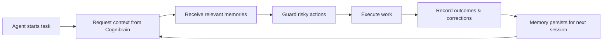
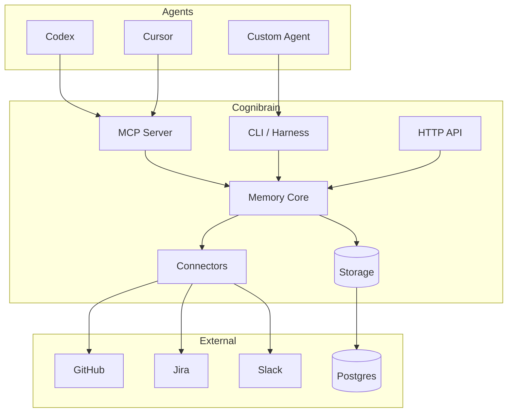

# Overview

Cognibrain is a **self-hosted engineering memory layer** that gives coding agents durable recall across sessions. It stores corrections, repo rules, action outcomes, connector events, and patch evidence — then returns compact, relevant context before each agent action.

## The Problem

Modern coding agents (Codex, Cursor, Copilot, custom LLM-based tools) are stateless by default. Every session starts fresh:

- A reviewer corrects an agent's approach → the agent makes the same mistake next time
- A build fails for a known reason → the agent re-discovers the fix from scratch
- Team conventions exist in scattered docs → agents miss them consistently

## How Cognibrain Solves It

Cognibrain acts as a **feedback loop** between agent sessions:

1. **Before acting** — the agent requests a context pack (corrections, conventions, past outcomes relevant to the current task)
2. **Before risky operations** — the action guard warns or blocks known-bad patterns
3. **After completing work** — the agent records what happened (patch evidence, corrections, new facts)
4. **Between sessions** — dream cycles consolidate, deduplicate, and surface stale memories for operator review

## Integration Surfaces

Cognibrain exposes four surfaces, each optimized for a different consumer:

| Surface | Best for | Protocol |
|---------|----------|----------|
| **CLI** | Operators, CI/CD, shell scripts | Text + JSON stdout |
| **Harness CLI** | Any shell-capable agent or git hook | JSON stdin/stdout |
| **MCP** | MCP-native agents (Codex, Cursor) | Model Context Protocol |
| **SDK/HTTP** | Product integrations, dashboards, custom runtimes | REST API / TypeScript / Python |

All surfaces share the same underlying memory engine and can run against the same local daemon.

## Architecture at a Glance

## Key Concepts

| Concept | Meaning |
|---------|---------|
| **Memory** | A durable, scoped fact that can be recalled before an agent acts |
| **Operator** | The human responsible for inspecting and maintaining memory state |
| **Connector** | An integration source/sink that ingests external events or writes back context |
| **Harness** | An agent lifecycle integration that calls Cognibrain for context, guards, and outcomes |
| **Dream Cycle** | A maintenance pass that detects stale memories and schedules operator review |
| **Action Guard** | A pre-action check that warns or blocks known-bad operations |
| **Patch Evidence** | A record of files changed, commands run, and memories used during a task |

## Open Source + Commercial

Cognibrain follows an **open core** model:

- :white_check_mark: **MIT (open source)** — CLI, API, SDK, connectors, harness templates, MCP server, all documentation
- :lock: **Commercial add-on** — Operator UI (browser-based dashboard for visual memory management)

The commercial Operator UI is never required. Every feature is accessible through the CLI and API.
