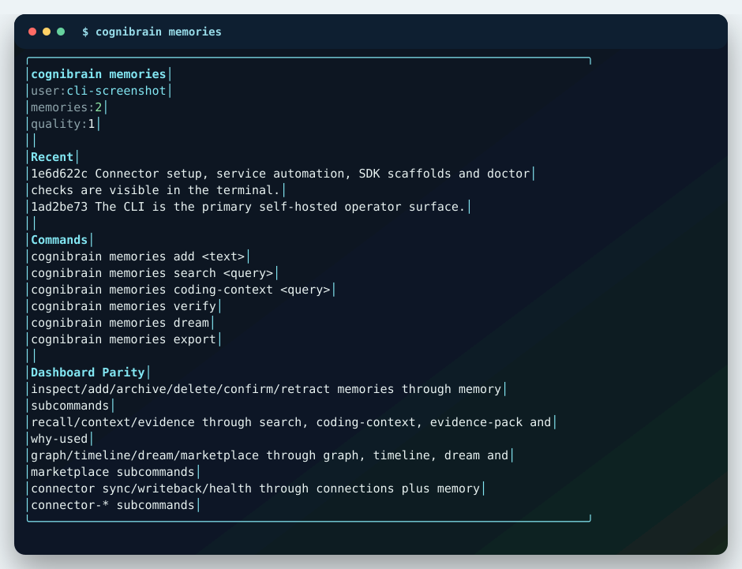

# Setup CLI

The CLI is the primary self-hosted product path. Install the package, run `cognibrain`, and operate memory, connections, config, setup, skills and runtime health from the terminal. It uses a React/Ink terminal UI when a real terminal is available and falls back to deterministic text output in CI.

```bash
npm i @cognilabz/cognibrain
npx cognibrain
npx cognibrain status
```

The browser dashboard is optional. Start it only when you want a visual inspection surface:

```bash
npx cognibrain dashboard
npx cognibrain start --dashboard
```

## Ink CLI Screenshots

The installable CLI is an Ink terminal UI first, with JSON output for scripts. Home, memories, connections, service automation, config, connector, adapter, SDK, skill and doctor surfaces all render as structured terminal panels when `stdout` is a TTY.





Regenerate these screenshots from real CLI output after UI changes:

```bash
npm run docs:cli-screenshots
```

## Guided Install

```bash
npx cognibrain init
```

The wizard asks for:

- install profile: `solo-dev`, `team`, `enterprise` or `benchmark`,
- agent harnesses,
- storage mode,
- auth mode,
- connectors,
- whether to run the first-win demo.

It writes:

- `.cognibrain/setup-state.json`,
- `.cognibrain/connectors/*.json`,
- `.cognibrain/adapters/*.json`,
- MCP or instruction files for selected harnesses,
- `.cognibrain-harness-package.json`.

By default setup starts the local API and keeps the dashboard off. Add `--dashboard` if you want setup to start the browser UI as well:

```bash
npx cognibrain init --dashboard
```

## Daily CLI Home

Run `cognibrain` with no subcommand to see the same operational state the dashboard exposes: runtime status, recent memory health, configured connectors, configured adapters, setup profile, skill state and next actions.

```bash
npx cognibrain
npx cognibrain status --json
npx cognibrain memories
npx cognibrain connections
```

Use `memory` for raw command-level operations and `memories` for the terminal workbench:

```bash
npx cognibrain memories add "Atlas releases require npm test before publish."
npx cognibrain memories search "release checks"
npx cognibrain memories coding-context "prepare a release patch"
npx cognibrain memory why-used "Why did this release memory appear?"
```

## Service Automation

Use `service` when cognibrain should start automatically after login or boot. The command is still CLI-first: it shows the exact native file, environment, runtime root and activation command before you enable anything.

```bash
npx cognibrain service plan
npx cognibrain service plan --platform linux --json
npx cognibrain service plan --platform macos --json
npx cognibrain service plan --platform windows --json
npx cognibrain service install --activate
npx cognibrain service status
npx cognibrain service start
npx cognibrain service stop
npx cognibrain service uninstall --deactivate
```

Supported managers:

| OS | Manager | Default scope |
| --- | --- | --- |
| Linux | systemd | user service, `--system` for machine service |
| macOS | launchd | LaunchAgent, `--system` for LaunchDaemon |
| Windows | Task Scheduler | current-user startup task |

Configure the service without editing generated files:

```bash
npx cognibrain service install --env MEMORY_REQUIRE_AUTH=true
npx cognibrain service install --dashboard --port 8787 --dashboard-port 5173
npx cognibrain service install --db-path .cognibrain/memory.json
```

The service runs `cognibrain --runtime-root <path> dev` in the foreground so systemd, launchd or Task Scheduler owns the process. `cognibrain start` remains the manual API daemon path. Do not put secret token values directly into `--env`; use deployment-owned service-manager secret handling for production credentials.

## Non-Interactive Profiles

```bash
npx cognibrain init --profile solo-dev --yes
npx cognibrain init --profile team --yes
npx cognibrain init --profile enterprise --yes
npx cognibrain init --profile benchmark --yes
```

Aliases also work through `setup`:

```bash
npx cognibrain setup --profile local --yes
npx cognibrain setup --profile production --yes
```

## Connector Setup

Connector configs are credential-safe. They point the built-in native drivers at the right workspace, project, channel or account, store `env:` references for secrets, and never store token values. Use `connections` when you want the product-level surface and `connector` when you want the lower-level connector command directly.

```bash
npx cognibrain connections add github --set repo=cognilabz/cognibrain
npx cognibrain connections add jira --set baseUrl=https://example.atlassian.net --set project=ENG
npx cognibrain connections add confluence --set baseUrl=https://example.atlassian.net --set space=ENG
npx cognibrain connections add notion --set databaseId=notion_database_id
npx cognibrain connections add linear --set teamId=linear_team_id
npx cognibrain connections add slack --set channelId=C123
npx cognibrain connections add discord --set channelId=D123
npx cognibrain connections
npx cognibrain connections connectors show github
npx cognibrain connections doctor
```

The same CLI configures the rest of the native vendor drivers:

```bash
npx cognibrain connections add gitlab --set project=group/project
npx cognibrain connections add azure-devops --set organization=my-org --set project=my-project
npx cognibrain connections add teams --set teamId=team --set channelId=channel
npx cognibrain connections add gmail --set account=engineering@example.com
npx cognibrain connections add google-drive --set root=drive_root_id
npx cognibrain connections add google-calendar --set calendarId=primary
npx cognibrain connections add sentry --set organization=my-org --set project=web
npx cognibrain connections add datadog --set site=datadoghq.com --set apiKeyEnv=MEMORY_DATADOG_API_KEY --set appKeyEnv=MEMORY_DATADOG_APP_KEY
npx cognibrain connections add pagerduty --set account=my-team --set service=service_id
npx cognibrain connections add asana --set workspace=workspace_gid --set project=project_gid
npx cognibrain connections add clickup --set listId=list_id
npx cognibrain connections add posthog --set project=project_id
```

Run `npm run verify:vendor-connectors` for hermetic proof that these drivers call the expected vendor APIs. Run `npm run verify:vendor-live -- --live` only in a real deployment with your tenant credentials.

## Platform SDK Scaffold

When a source system is not built in yet, scaffold a custom integration instead of hand-writing a connector from scratch:

```bash
npx cognibrain sdk list
npx cognibrain sdk platform acme --kind project_management --out integrations/acme
npx cognibrain sdk doctor
```

The scaffold creates a TypeScript integration, connector manifest, `.env.example` and local runbook. Edit the generated `poll()` and `mapRecord()` functions, then register the manifest and run one sync:

```bash
npx cognibrain memory connector-register "$(cat integrations/acme/acme.connector.json)"
npx tsx integrations/acme/acme.integration.ts
npx cognibrain memory connector-health acme
```

## Adapter Setup

Adapters are the runtime extension points behind storage, provider intelligence, media extraction, benchmark comparisons and remote MCP transport. They are also configured through the CLI and use the same no-secret-values policy.

```bash
npx cognibrain connections adapters list
npx cognibrain connections add storage-sqlite --set path=.cognibrain/memory.sqlite
npx cognibrain connections add storage-postgres --url-env MEMORY_POSTGRES_URL
npx cognibrain connections add intelligence-json-command --command-env MEMORY_INTELLIGENCE_COMMAND
npx cognibrain connections add embedding-openai-compatible --set baseUrl=http://localhost:11434/v1 --set model=text-embedding-3-small
npx cognibrain connections add media-json-command --command-env MEMORY_MEDIA_COMMAND
npx cognibrain connections add benchmark-arena
npx cognibrain connections add mcp-remote --set url=https://memory.example.com/mcp --token-env MEMORY_MCP_REMOTE_TOKEN
npx cognibrain connections adapters doctor
```

## Config And Skill

Use `config` when you want to inspect or regenerate generated setup files without reading the filesystem manually.

```bash
npx cognibrain config list
npx cognibrain config show --json
npx cognibrain config paths
npx cognibrain config doctor
npx cognibrain config codex
npx cognibrain config all
```

The Codex Skill lifecycle is also CLI-controlled:

```bash
npx cognibrain skill status
npx cognibrain skill install
npx cognibrain skill doctor --fix
npx cognibrain skill path
```

## Doctor And Proof

```bash
npx cognibrain doctor --fix
npx cognibrain doctor --publish
npx cognibrain config doctor
npx cognibrain connections doctor
npx cognibrain connections connectors doctor
npx cognibrain connections adapters doctor
npm run verify:compatibility
npm run verify:vendor-connectors
```

`doctor --fix` creates missing setup state, connector directories, harness package metadata and local runtime pieces that are safe to repair automatically.
