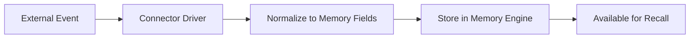

# Connectors

Cognibrain connects to external systems through **connectors** — configured integration sources and sinks that ingest events, surface review queues, or write back memory-linked context.

## First-Party Connectors

Cognibrain includes connector definitions and drivers for 19+ systems:

| Category | Connectors |
|----------|-----------|
| **Code** | GitHub, GitLab, Azure DevOps |
| **Planning** | Jira, Linear, Asana, ClickUp |
| **Documentation** | Confluence, Notion, Google Drive |
| **Chat** | Slack, Discord, Microsoft Teams |
| **Email & Calendar** | Gmail, Google Calendar |
| **Observability** | Sentry, Datadog, PagerDuty, PostHog |
| **Storage** | PostgreSQL (as connector) |

## Adding Connectors

### Basic Setup

```bash
npx cognibrain connections list                    # See available connectors
npx cognibrain connections add github --set repo=cognilabz/cognibrain
npx cognibrain connections add jira --set baseUrl=https://example.atlassian.net --set project=ENG
npx cognibrain connections add slack --set channelId=C123 --token-env MEMORY_SLACK_TOKEN
```

### Storage Connectors

```bash
npx cognibrain connections add storage-postgres --url-env MEMORY_POSTGRES_URL
```

### Health Check

```bash
npx cognibrain connections doctor
```

## Configuration

Connector configs store non-secret identifiers, URLs, and `env:` references. Secrets stay in environment variables or a secret manager.

```bash
# Non-secret values go in config
npx cognibrain connections add github --set repo=cognilabz/cognibrain

# Secrets reference env vars
npx cognibrain connections add slack --token-env MEMORY_SLACK_TOKEN
```

!!! danger "Never commit secrets"
    Connector configurations should never contain literal tokens or passwords. Use `--token-env`, `--url-env`, or set secrets in your environment / secret manager.

## Connector Maturity

Not all connectors are at the same maturity level:

| Level | Meaning |
|-------|---------|
| **Implementation-ready** | Code complete, unit tested |
| **Credential-blocked** | Needs tenant credentials for live verification |
| **Tenant-verified** | Tested against a real instance with credentials |

Check maturity:

```bash
npm run internal -- connectors:maturity
```

## Connector Lifecycle



Connectors can:

- **Ingest** events from external systems (e.g., Jira issue updates, Slack messages)
- **Surface** review queues for operator attention
- **Write back** memory-linked context to external systems

## Live Smoke Testing

For connectors with credentials available:

```bash
# Read-only smoke
MEMORY_VENDOR_LIVE_SMOKE=true npm run internal -- verify:vendor-live

# Read+write smoke
MEMORY_VENDOR_LIVE_SMOKE=true MEMORY_VENDOR_LIVE_WRITE=true npm run internal -- verify:vendor-live
```

## Next Steps

- [Connector SDK →](../contributing/connector-sdk.md) — Build community connectors
- [Configuration →](../reference/configuration.md) — Environment variables for connectors
- [Security →](../operations/security.md) — Secret management best practices
