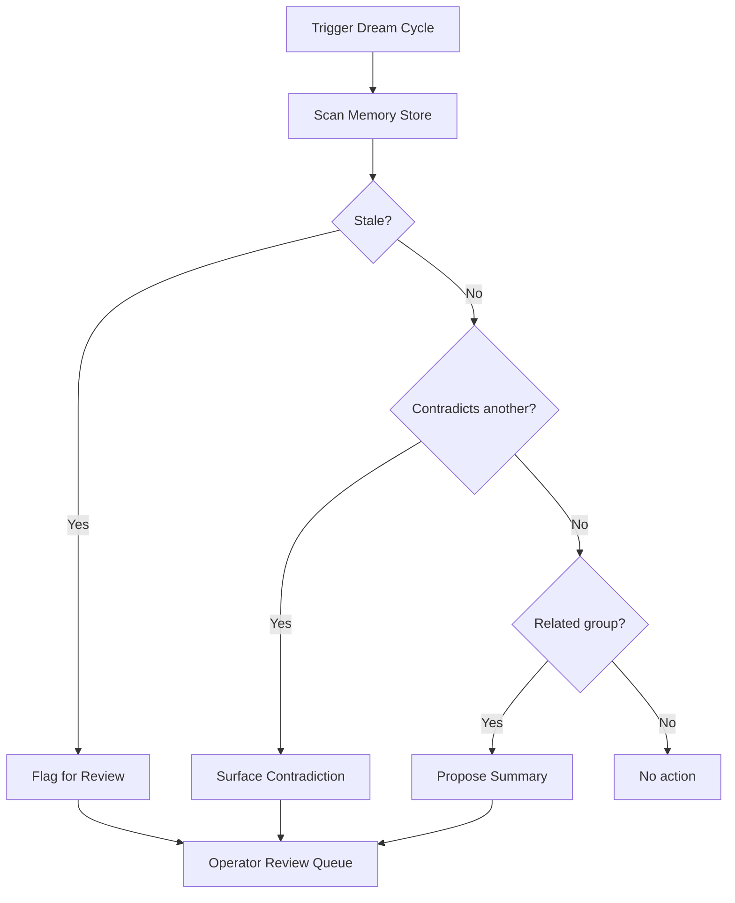

# Dream Cycles

Dream cycles are automated memory maintenance passes that keep your memory store healthy, relevant, and contradiction-free.

## What Is a Dream Cycle?

A dream cycle is a periodic background process that:

- **Detects stale memories** that haven't been recalled in a long time
- **Identifies contradictions** between memories
- **Produces summaries** by consolidating related memories
- **Schedules operator review** for items that need human judgment

Think of it as garbage collection for engineering knowledge — it runs quietly and surfaces only what needs attention.

## How It Works



## Triggering Dream Cycles

### Automatic (on session end)

```bash
npx cognibrain session-end --run-dream-if-due --json
```

This triggers a dream cycle only if enough time has passed since the last one.

### Manual

```bash
npx cognibrain dream-plan --json
```

View what the dream cycle would do without executing changes.

### From the Lifecycle

Dream cycles can be configured to run:

- After every N sessions
- On a time schedule (daily, weekly)
- On-demand via the CLI

## Operator Review

When a dream cycle surfaces items for review, operators can inspect and act:

```bash
npx cognibrain memories list --status review
npx cognibrain memories approve <id>
npx cognibrain memories archive <id>
```

Harnesses may surface urgent review context inline, while the CLI remains the
V1 surface for explicit inspection and repair.

## Staleness Detection

A memory becomes a staleness candidate when:

1. It hasn't been recalled in any context pack for a configurable period
2. It hasn't been manually referenced or updated
3. Related memories have superseded its content

!!! info "Staleness ≠ deletion"
    Stale memories are flagged for review, not automatically deleted. Only an operator can archive a memory.

## Contradiction Detection

Contradictions are detected when:

- Two memories make opposing claims about the same topic
- A newer correction invalidates an older fact
- Connector events conflict with stored conventions

```bash
npx cognibrain conflicts --json
```

## Summary Consolidation

When multiple memories cover overlapping ground, the dream cycle may propose consolidating them into a single, cleaner memory. Example:

**Before:**
- "Run npm test before release"
- "Always test before publishing"
- "The release script requires passing tests"

**After (proposed):**
- "Release requires npm test to pass — enforced by the release script and CI"

Consolidation proposals require operator approval before taking effect.

## Configuration

Dream cycle behavior is configurable through environment variables and runtime settings:

| Setting | Default | Description |
|---------|---------|-------------|
| Staleness threshold | 30 days | Days without recall before flagging |
| Auto-run frequency | Per 10 sessions | Sessions between automatic runs |
| Max items per cycle | 20 | Limit on items surfaced per run |

## Best Practices

!!! tip "Run regularly"
    Don't let memory stores grow unchecked. Regular dream cycles keep context packs fast and relevant.

!!! tip "Review promptly"
    Stale items in the review queue add noise. Approve or archive them within a few days.

!!! tip "Trust the consolidation"
    Summary proposals are conservative. If a consolidation looks right, approve it — fewer, better memories beat many overlapping ones.
