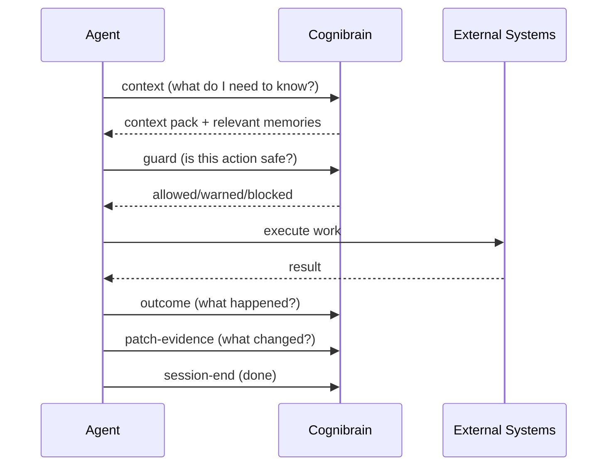

# Harness Lifecycle

The harness lifecycle is a JSON-first shell integration that any agent, git hook, or CI runner can call. It provides the same memory capabilities as MCP but through standard shell commands.

## Overview

The harness defines a simple lifecycle loop:



## Commands

All harness commands support `--json` for structured output. The top-level commands are preferred for new integrations:

### Context

Request memories relevant to the current task:

```bash
npx cognibrain context --task "prepare the release patch" --json
npx cognibrain context --task "fix auth" --repo cognilabz/cognibrain --json
```

### Guard

Check an action before executing:

```bash
npx cognibrain guard --action "npm test" --json
npx cognibrain guard --action "rm -rf node_modules" --json
```

Response includes `allowed`, `warnings`, and `blockers`.

### Outcome

Record the result of a command:

```bash
npx cognibrain outcome --command "npm test" --exit-code 0 --json
npx cognibrain outcome --command "npm run build" --exit-code 1 --stderr "..." --json
```

### Correction

Store a human correction for future recall:

```bash
npx cognibrain correction --text "Use npm test, not pnpm." --json
```

### Patch Evidence

Record what files changed and what commands ran:

```bash
npx cognibrain patch-evidence \
  --task "package cleanup" \
  --files package.json \
  --commands "npm test" \
  --json
```

### Session End

Signal the end of an agent session:

```bash
npx cognibrain session-end --json
npx cognibrain session-end --run-dream-if-due --json
```

### Additional Commands

```bash
npx cognibrain release-prepare --repo cognilabz/cognibrain --json
npx cognibrain dream-plan --json
npx cognibrain source-revalidate --user local --json
npx cognibrain conflicts --json
npx cognibrain health --json
```

## Backward Compatibility

The `cognibrain harness` prefix is a backward-compatible alias:

```bash
# These are equivalent:
npx cognibrain context --task "fix auth" --json
npx cognibrain harness context --task "fix auth" --json
```

New scripts should use the top-level commands directly.

## Authentication

For daemon-backed mode with auth:

```bash
# Environment variable (preferred)
export MEMORY_API_KEY=your-key
npx cognibrain context --task "..." --json

# Inline flag
npx cognibrain context --task "..." --api-key your-key --json

# Bearer token
npx cognibrain context --task "..." --bearer-token your-jwt --json
```

Supported auth sources:

| Method | Usage |
|--------|-------|
| `--api-key` | Inline API key |
| `--bearer-token` | JWT/OIDC bearer token |
| `--auth-env` | Read token from a named env var |
| `MEMORY_API_KEY` | Default API key env var |
| `COGNIBRAIN_API_KEY` | Alternative API key env var |
| `COGNIBRAIN_API_TOKEN` | Alternative token env var |
| `MEMORY_BEARER_TOKEN` | Bearer token env var |

!!! warning "Production mode"
    In production/security mode, the harness CLI **requires** the daemon unless `--local-direct` is explicitly requested. This prevents accidental unauthenticated local access.

## CI/CD Integration

### GitHub Actions

```yaml
steps:
  - name: Get context
    run: npx cognibrain context --task "${{ github.event.pull_request.title }}" --json

  - name: Run tests
    run: npm test

  - name: Record outcome
    run: npx cognibrain outcome --command "npm test" --exit-code $? --json
```

### Git Hooks

```bash
#!/bin/sh
# .git/hooks/pre-push
npx cognibrain guard --action "git push" --json | jq -e '.allowed' || exit 1
```

## Local-Direct Mode

For debugging or environments without a running daemon:

```bash
npx cognibrain context --task "..." --local-direct --json
```

This bypasses the HTTP daemon and operates directly against local storage. Not recommended for production.
