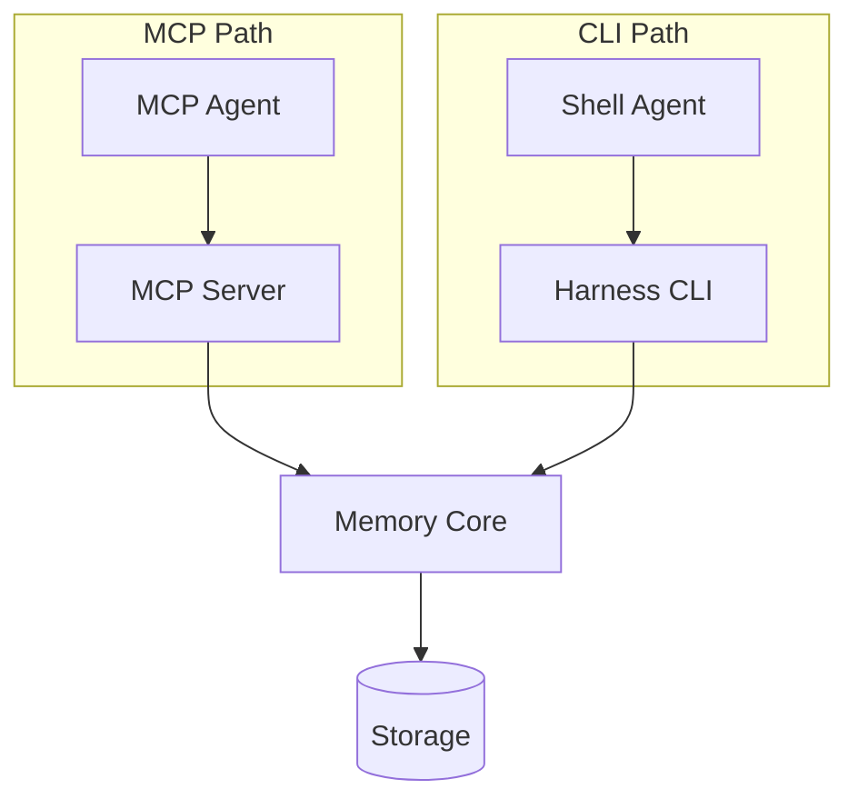

# MCP Integration

The Model Context Protocol (MCP) integration lets MCP-native agents (Codex, Cursor, and others) communicate with Cognibrain directly through the standardized MCP tool interface.

## When to Use MCP

Use MCP when your agent host natively supports the Model Context Protocol. For agents that can only run shell commands, use the [Harness Lifecycle](harness-lifecycle.md) instead.

| Agent Host | Recommended Surface |
|-----------|-------------------|
| OpenAI Codex | MCP |
| Cursor | MCP |
| Custom MCP host | MCP |
| CI/CD pipelines | Harness CLI |
| Git hooks | Harness CLI |
| Non-MCP agents | Harness CLI or SDK |

## Setup

### Cursor

The `init` command automatically generates Cursor MCP configuration:

```bash
npx cognibrain init --yes
# Creates .cursor/mcp.json and .cursor/rules/open-memory.mdc
```

To regenerate:

```bash
npx cognibrain config cursor
```

??? example "Generated `.cursor/mcp.json`"
    ```json
    {
      "mcpServers": {
        "cognibrain": {
          "command": "npx",
          "args": ["cognibrain", "mcp", "serve"],
          "env": {}
        }
      }
    }
    ```

### Codex

```bash
npx cognibrain config codex
# Updates $CODEX_HOME/config.toml and writes AGENTS.md
```

### Manual MCP Server Start

For custom MCP hosts, start the MCP server directly:

```bash
npx cognibrain mcp serve
```

This starts an MCP stdio server that any MCP-compatible client can connect to.

## Available MCP Tools

The MCP server exposes these tool classes:

### Context Pack

Retrieve compact memory context for a task before the agent begins work.

```
Tool: cognibrain_context
Input: { "task": "prepare the release patch", "tokenBudget": 1200 }
Output: { "context": "...", "memoriesUsed": 5 }
```

### Coding Context

Retrieve codebase-specific corrections and conventions relevant to files being edited.

```
Tool: cognibrain_coding_context
Input: { "task": "fix auth refresh", "files": ["src/auth.ts"] }
Output: { "corrections": [...], "conventions": [...] }
```

### Action Guard

Check a planned action against known guards before executing.

```
Tool: cognibrain_guard
Input: { "action": "edit src/api/server.ts" }
Output: { "allowed": true, "warnings": [] }
```

### Memory Add

Store a durable correction, decision, or fact.

```
Tool: cognibrain_memory_add
Input: { "content": "Use JWT RS256 for auth tokens", "scope": "repo" }
Output: { "id": "mem_abc123", "stored": true }
```

### Patch Evidence

Record files changed, commands run, and memories used during a task.

```
Tool: cognibrain_patch_evidence
Input: { "task": "auth fix", "files": ["src/auth.ts"], "commands": ["npm test"] }
Output: { "evidenceId": "ev_xyz789" }
```

### Maintenance

Inspect health and trigger dream-cycle maintenance.

```
Tool: cognibrain_health
Input: {}
Output: { "status": "healthy", "memoryCount": 42, "staleCandidates": 2 }
```

## Authentication

For local development with `solo-dev` profile, no authentication is needed.

For daemon-backed deployments with auth enabled:

```json
{
  "mcpServers": {
    "cognibrain": {
      "command": "npx",
      "args": ["cognibrain", "mcp", "serve"],
      "env": {
        "MEMORY_API_KEY": "${env:MEMORY_API_KEY}"
      }
    }
  }
}
```

## MCP vs CLI Lifecycle

Both MCP and CLI lifecycle commands hit the same memory engine:



Choose based on what your agent host supports. The memory behavior is identical regardless of surface.

## Troubleshooting

!!! warning "MCP server not responding"
    Ensure the Cognibrain daemon is running:
    ```bash
    npx cognibrain status
    npx cognibrain start  # if stopped
    ```

!!! warning "Authentication errors"
    If you see auth errors in MCP, verify your API key:
    ```bash
    npx cognibrain doctor --fix
    ```
