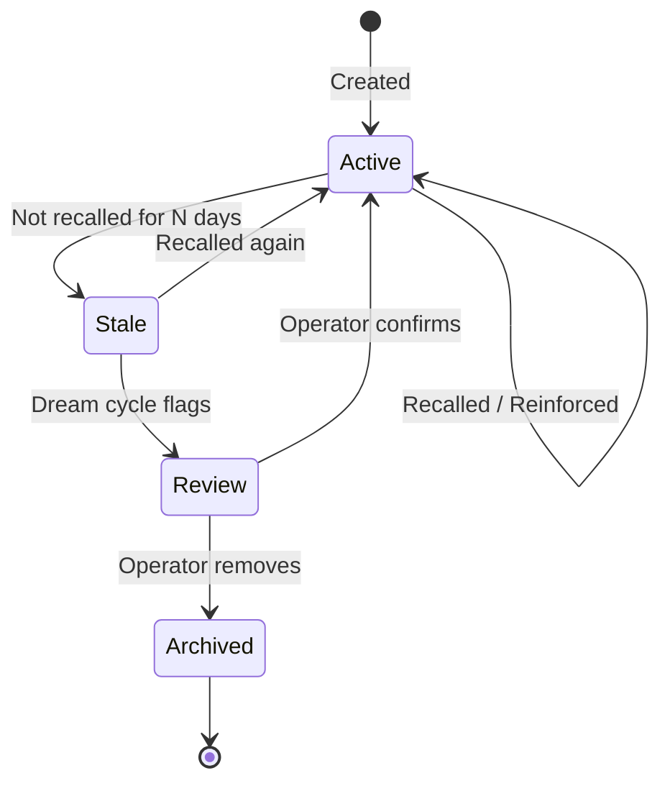

# Memory Management

Memories are the core primitive of Cognibrain — durable, scoped facts that coding agents can recall before acting.

## What Is a Memory?

A memory is any piece of engineering knowledge worth preserving across sessions:

- **Corrections**: "Use `npm test`, not `pnpm test`"
- **Conventions**: "All API routes require auth middleware"
- **Procedures**: "Run `npm run build` before releasing"
- **Preferences**: "Use single quotes in TypeScript"
- **Evidence**: "The auth refactor was completed on 2026-06-01"
- **Facts**: "The database schema uses UUID primary keys"

## Creating Memories

### From the CLI

```bash
npx cognibrain memories add "This repo uses npm test before release."
npx cognibrain memories add "Never edit generated files in dist/" --scope repo
```

### From Agent Corrections

When an operator corrects an agent:

```bash
npx cognibrain correction --text "Use npm test, not pnpm." --json
```

### From Connector Events

Connectors can automatically create memories from external events (e.g., a merged PR that changes conventions).

## Memory Scopes

Memories are scoped to control where they're recalled:

| Scope | Recalled when |
|-------|--------------|
| `repo` | Working in the associated repository |
| `user` | Working as the associated user (any repo) |
| `global` | Always available |
| `task` | Relevant to specific task types |

```bash
npx cognibrain memories add "Deploy requires VPN" --scope repo
npx cognibrain memories add "I prefer verbose error messages" --scope user
```

## Retrieving Memories

### Context Pack

Get a curated set of memories for a specific task:

```bash
npx cognibrain context --task "fix the auth token refresh" --json
```

The context pack uses relevance scoring to return the most useful memories within a token budget.

### Coding Context

Get corrections and conventions for specific files:

```bash
npx cognibrain memories coding-context "refactor the API layer" --json
```

### List All

```bash
npx cognibrain memories list
npx cognibrain memories list --scope repo --limit 50 --json
```

## Memory Lifecycle



Memories follow a natural lifecycle:

1. **Active** — recently created or recalled, participates in context packs
2. **Stale** — not recalled for an extended period, candidate for review
3. **Under Review** — flagged by a dream cycle for operator attention
4. **Archived** — removed by operator, no longer recalled

## Token Budgets

When requesting context, you can control how much memory is returned:

```bash
npx cognibrain context --task "release prep" --budget 800 --json
```

Cognibrain ranks memories by relevance and fills the budget with the most useful items. This prevents context windows from being overwhelmed with low-value recall.

## Conflict Resolution

When memories contradict each other, Cognibrain uses:

1. **Recency** — newer memories take precedence
2. **Source authority** — operator corrections outrank auto-ingested facts
3. **Scope specificity** — repo-scoped memories outrank global for in-repo work
4. **Dream cycle resolution** — contradictions are surfaced for operator review

```bash
npx cognibrain conflicts --json
```

## Best Practices

!!! tip "Be specific"
    "Use npm test" is better than "Run tests". Specific memories are easier to match and recall.

!!! tip "Include context"
    "In the auth module, always validate JWT expiry before refresh" beats "Validate JWT expiry".

!!! tip "Let agents self-correct"
    Configure your agent to call `cognibrain correction` whenever it receives human feedback. This builds memory organically.

!!! warning "Don't store secrets"
    Never store API keys, tokens, or passwords as memories. Use environment variables and reference them by name.
