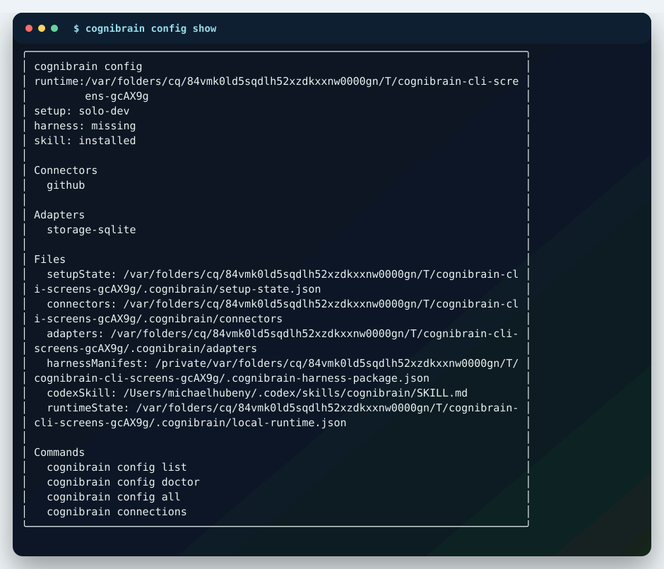

# Install And Self-Hosting

The install path is intentionally terminal-first. Install the package, open the Ink CLI, and keep the dashboard off unless you want a browser view.

```bash
npm i @cognilabz/cognibrain
npx cognibrain
npx cognibrain init
npx cognibrain doctor --fix
```

Checkout install:

```bash
git clone https://github.com/cognilabz/cognibrain.git
cd cognibrain
npm install
./bin/cognibrain.mjs init --profile solo-dev --yes
./bin/cognibrain.mjs doctor --fix
```

## CLI Workbenches



```bash
npx cognibrain status
npx cognibrain memories
npx cognibrain connections
npx cognibrain config show
npx cognibrain skill status
npx cognibrain doctor --fix
```

Every workbench keeps a `--json` mode for automation.

## Setup Profiles

Running `npx cognibrain init` in a TTY opens the guided wizard. It asks:

- what should improve first: repeated mistakes, repo rules/tests, work-system connectors, benchmark demo or team server,
- which agent you use: Codex, Claude Code, Cursor, Copilot or LangGraph/CrewAI,
- connector, storage, auth and first-win demo choices.

For CI, docs and deterministic setup, use `--profile ... --yes`.

| Profile | Use it for | Command |
| --- | --- | --- |
| `solo-dev` | Local developer memory with local storage and GitHub defaults. | `npx cognibrain init --profile solo-dev --yes` |
| `team` | Shared self-hosted team workspace with broader harness and connector setup. | `npx cognibrain init --profile team --yes` |
| `enterprise` | Pilot deployment with Postgres, auth boundary and live connector smoke expectations. | `npx cognibrain init --profile enterprise --yes` |
| `benchmark` | Local proof lab for repeatable benchmark artifacts. | `npx cognibrain init --profile benchmark --yes` |

## Service Automation


```bash
npx cognibrain service plan
npx cognibrain service plan --platform linux --json
npx cognibrain service plan --platform macos --json
npx cognibrain service plan --platform windows --json
npx cognibrain service install --activate
npx cognibrain service status
npx cognibrain service logs
```

| OS | Manager | Default scope |
| --- | --- | --- |
| Linux | systemd | user service, `--system` for machine service |
| macOS | launchd | LaunchAgent, `--system` for LaunchDaemon |
| Windows | Task Scheduler | current-user startup task |

Service flags:

```bash
npx cognibrain service install --env MEMORY_REQUIRE_AUTH=true
npx cognibrain service install --dashboard --port 8787 --dashboard-port 5173
npx cognibrain service install --db-path .cognibrain/memory.json
```

Do not put secret token values directly into `--env`. Use the host service manager or deployment secret tooling for production credentials.

## Optional Dashboard

```bash
npx cognibrain dashboard
npx cognibrain start --dashboard
```

The dashboard is an inspection view. It is not required for setup, operation, service startup or connector configuration.
