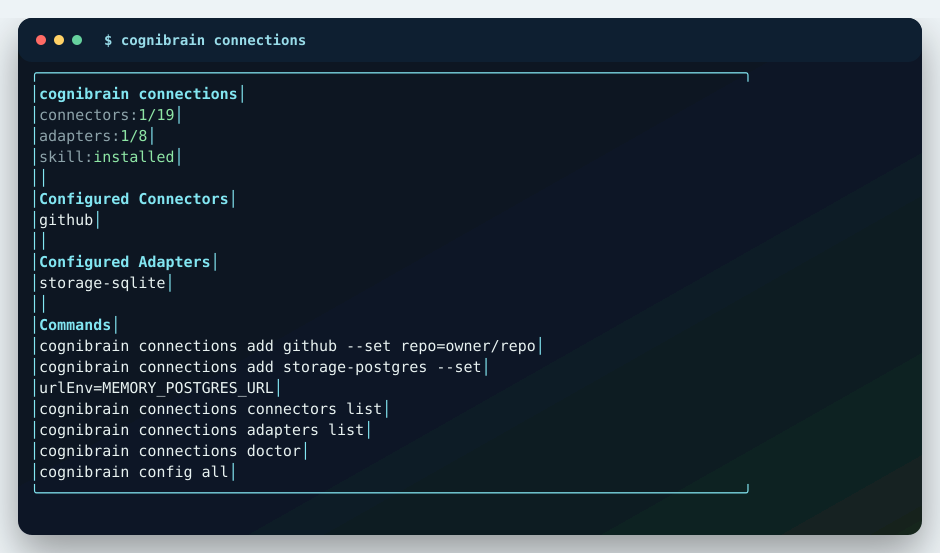
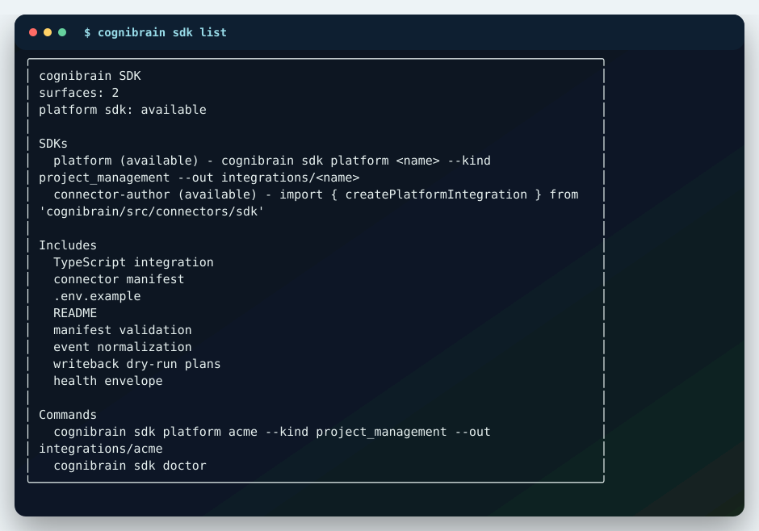

# Connectors, Adapters And SDK

Cognibrain can run as a local agent memory layer, a connector-backed memory hub, or a source-system integration SDK.

## Native Connectors



Native drivers are implemented for the systems below. Driver status is not the same as production certification; see the generated [Connector Maturity Matrix](integrations/connector-maturity.md) for fixture, live-smoke, writeback and certification status.

Current checked connector state: 19 hermetic drivers, 19 API/spec-verified drivers, 19 live-smoke-ready drivers, 10 webhook-verified priority drivers, 0 tenant-verified live smokes and 0 production certifications. That means the code has first-party driver paths, fixture proof, API-contract checks for method/path/auth/writeback shape, priority webhook signature/replay/normalization proof and live-smoke harness support. This checkout has not proven a customer tenant for Jira, Confluence, Notion, Linear or the other vendors.

| Category | Connectors |
| --- | --- |
| Code | GitHub, GitLab, Azure DevOps |
| Chat | Slack, Discord, Microsoft Teams |
| Planning and docs | Jira, Confluence, Notion, Linear |
| Google workspace | Gmail, Google Drive, Google Calendar |
| Work tracking | Asana, ClickUp |
| Operations and product | Sentry, Datadog, PagerDuty and PostHog |

Configure connectors from the CLI:

```bash
npx cognibrain connections add github --set repo=cognilabz/cognibrain
npx cognibrain connections add jira --set baseUrl=https://example.atlassian.net --set project=ENG
npx cognibrain connections add slack --set channelId=C123 --token-env MEMORY_SLACK_TOKEN
npx cognibrain connections doctor
```

Configs store non-secret fields and `env:` references. Token values stay in environment variables or deployment secret tooling.

## Adapters

Runtime adapters cover storage, provider intelligence, embeddings, media extraction, benchmark comparison and remote MCP transport.

```bash
npx cognibrain connections add storage-sqlite --set path=.cognibrain/memory.sqlite
npx cognibrain connections add storage-postgres --url-env MEMORY_POSTGRES_URL
npx cognibrain connections add intelligence-json-command --command-env MEMORY_INTELLIGENCE_COMMAND
npx cognibrain connections add embedding-openai-compatible --set baseUrl=http://localhost:11434/v1 --set model=text-embedding-3-small
npx cognibrain connections add media-json-command --command-env MEMORY_MEDIA_COMMAND
npx cognibrain connections add mcp-remote --set url=https://memory.example.com/mcp --token-env MEMORY_MCP_REMOTE_TOKEN
```

## Platform SDK



Use the Platform SDK when the source system is not built in yet:

```bash
npx cognibrain sdk platform acme --kind project_management --out integrations/acme
npx cognibrain memory connector-register "$(cat integrations/acme/acme.connector.json)"
npx tsx integrations/acme/acme.integration.ts
npx cognibrain memory connector-health acme
```

The scaffold includes:

- TypeScript integration code,
- connector manifest,
- `.env.example`,
- local README,
- poll and writeback placeholders,
- normalized event mapping helpers.

## Agent Harnesses

Agent harness communication is layered:

| Surface | When to use it |
| --- | --- |
| MCP | Default for agents that can call tools directly: context, coding context, action guard, memory writes, corrections, patch evidence and maintenance. |
| CLI | Operator and fallback path: install configs, start/status, run `memories coding-context`, record actions and inspect proof. |
| SDK/HTTP | Runtime integrations and non-MCP helpers such as LangGraph, CrewAI and custom source-system adapters. |

For coding work, use `memory_context_pack` as the portable MCP baseline and `memory_coding_context_pack` where the host exposes it. Run `memory_action_guard` before shell or file operations with durable side effects. Non-MCP helpers should call `/coding-context-pack`, `/code/action-guard`, `/actions`, `/code/corrections` and `/patch-evidence` through the SDK or HTTP API.

```bash
npx cognibrain config codex
npx cognibrain config all
npx cognibrain config all --refresh
npx cognibrain-connect continue --no-start
npm run harness:maturity
npx cognibrain skill install
npx cognibrain mcp
```

Supported harness outputs cover Codex, Claude Code, GitHub Copilot, Cursor, VS Code, OpenCode, OpenClaw, LangGraph, CrewAI, Windsurf, Continue.dev, Aider, Roo Code/Cline, Goose, Sourcegraph Amp and a Devin-style external-agent mode. The generated [Harness Maturity Matrix](integrations/harness-maturity.md) separates config generation, rules, MCP hooks, pre-tool guards, telemetry, correction capture, evidence trails and E2E simulator proof. Devin-style external agent mode is generated through the external-agent JSON-command contract; a vendor-native Devin hook is not claimed.

Current checked harness state: 16 generated harness packages, 10 MCP-capable targets, 13 pre-tool guard targets, 15 correction-capture targets, 15 patch-evidence targets and 16 golden-path demos.

## Verification

```bash
npm run verify:connectors
npm run verify:vendor-connectors
npm run verify:vendor-api-specs
npm run verify:vendor-live
npm run verify:compatibility
npm run connectors:maturity
npm run harness:maturity
```

Real live-system proof is opt-in:

```bash
MEMORY_VENDOR_LIVE_SMOKE=true npm run verify:vendor-live
MEMORY_VENDOR_LIVE_SMOKE=true MEMORY_VENDOR_LIVE_WRITE=true npm run verify:vendor-live
```

The first command lists, polls and dry-runs writeback with tenant credentials. The second can write to real systems and should only run against a controlled test target.

Artifacts:

```text
artifacts/connectors-live.json
artifacts/vendor-connectors-live.json
artifacts/vendor-api-specs.json
artifacts/vendor-live-smoke.json
artifacts/connector-webhooks.json
artifacts/connector-maturity.json
docs/integrations/connector-maturity.md
artifacts/harness-maturity.json
docs/integrations/harness-maturity.md
```
